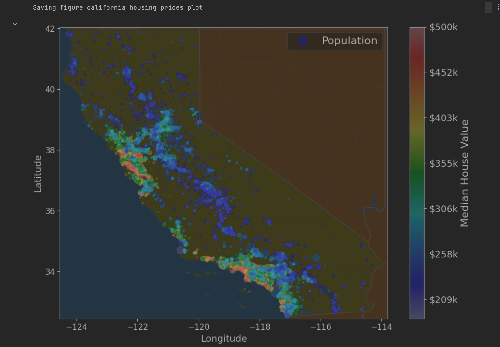
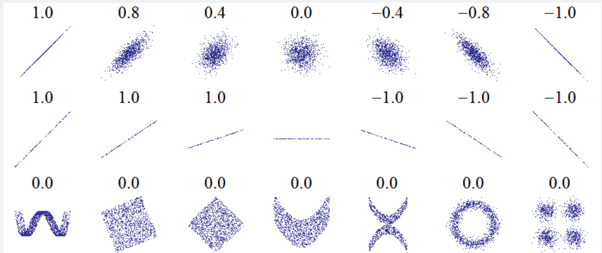
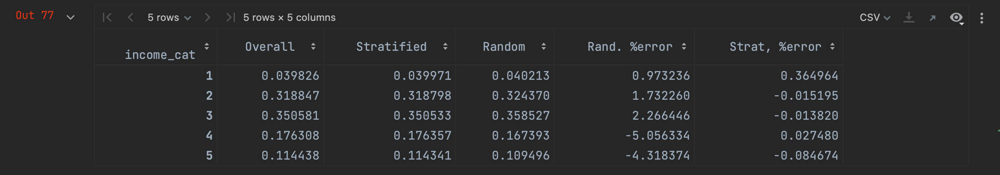
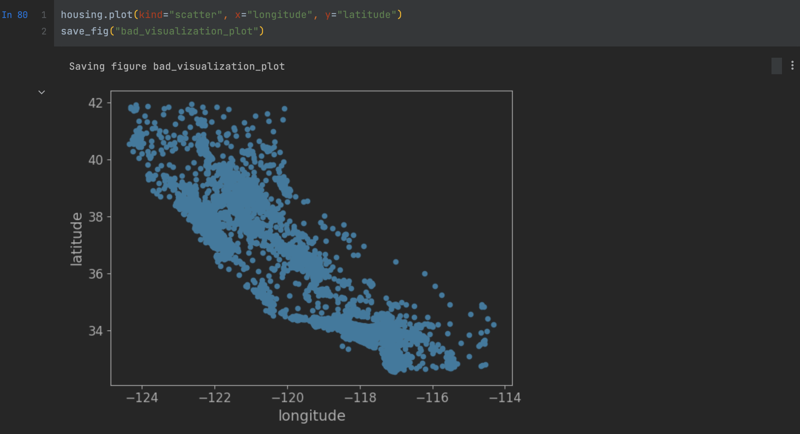
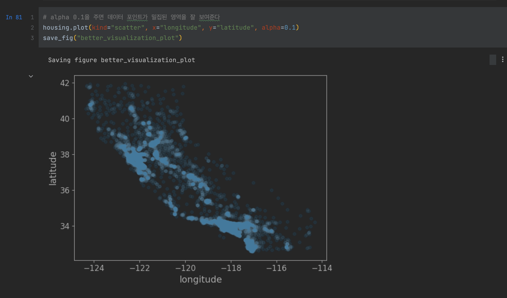
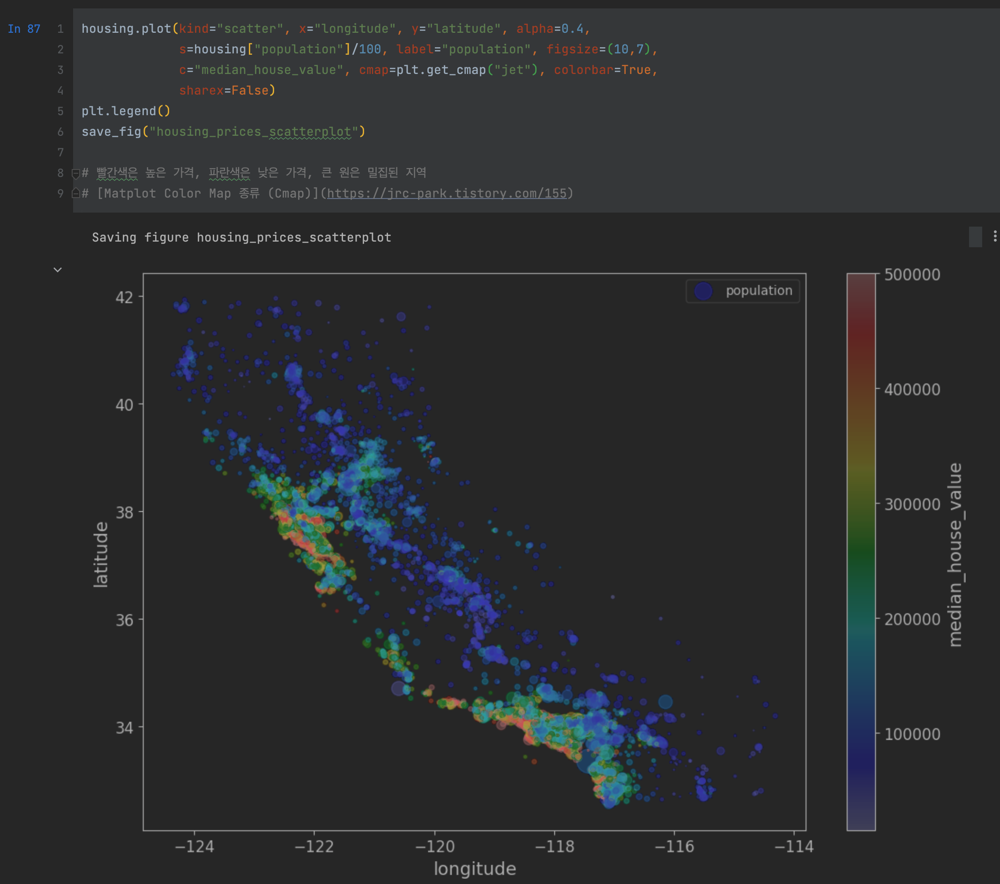
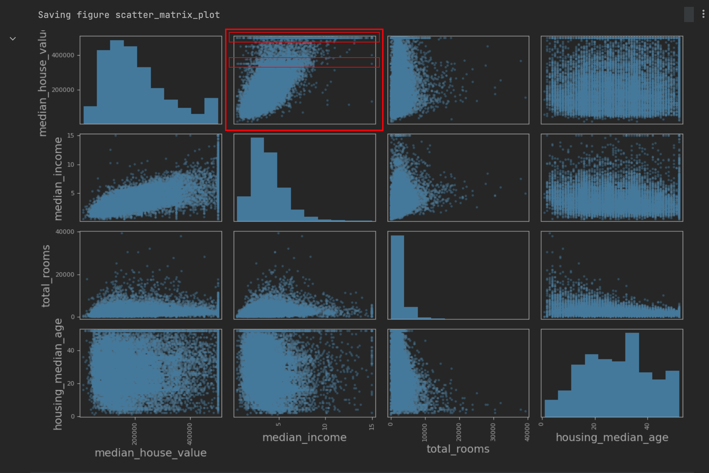
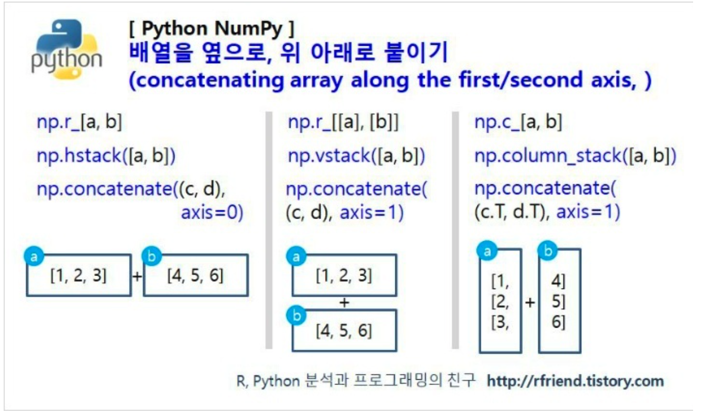
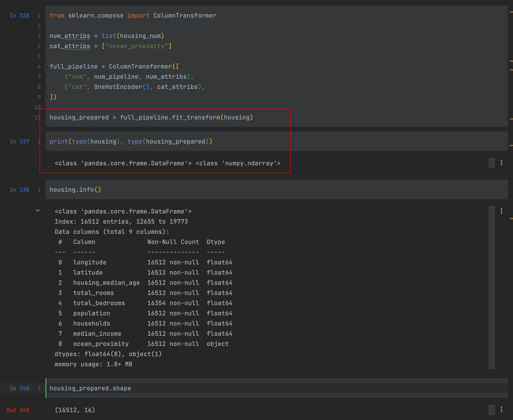

# 핸즈온 머신러닝
> 사이킷런, 케라스, 텐서플로2를 활용한 머신러닝, 딥러닝 완벽 실무

{width="500" height="700"}


## 2장 요약

* 유명한 공개 데이터 저장소
	- UC 얼바인 머신러닝 저장소
	- 캐글 데이터셋
	- 아마존 AWS 데이터셋
	- 데이터 포털
	- 오픈 데이터 모니터
	- 퀀들
	- 위키백과 머신러닝 데이터셋 목록
	- Quora.com
	- 데이터셋 서브레딧
	- StatLib
* 성능 측정 지표 선택
	- 회귀 문제의 전형적인 성능 지표는 평균 제곱근 오차 root mean square error (RMSE)를 사용한다
	- 하지만 이상한 데이터가 많다면 평균 절대 오차(평균 절대 편차)를 사용하기도 한다
	- 이 두가지 방법 모두 예측값의 벡터와 타깃값의 벡터 사이의 거리를 재는 방법이다.
	- 여러가지 norm 방법
		+ 유클리디안 norm: 제곱근을 합한 것의 제곱근
		+ 맨해튼 norm: 절댓값의 합을 계산
* 계층 샘플링으로 테스트 데이터셋 만들기
	- 일반 무작위 샘플링으로 만든 테스트 세트와 계층 샘플링을 사용해 만든 테스트 세트의 분포, 비율이 많이 다르다
	> 이게 중요한 이유는 예를들면, 설문조사 기관에서 1000명에게 질문을 몇 개 하려할때, 그냥 전화번호부에서 1000명을 뽑으면 결과를 편향시킬 수 있다.
전체 인구를 대표하는 1000명을 뽑기 위해서 노력할텐데..예를 들면 미국 인구의 남성이 51.3%, 여성이 48.7%라면 잘 구성된 설문조사는 샘플에서도 이 비율을 유지할 것이다.
	- 따라서 여기서는 중위 소득 카테고리를 기반으로 '계층 샘플링'하는 방법을 보여준다
	- 사이킷런의 `StratifiedShuffleSplit`을 사용한다

{width="800" height="400"}
> 그리고 이미지 위에 차트를 띄울 수도 있다. 주택가격 같은 위경도를 포함한 데이터에서 유용해보인다
x,y좌표를 위,경도로 두고 밀집도를 원의 크기, 주택 가격을 colorbar로 두어서 4가지 데이터를 2d 그래프 위에 표현하였다


* 상관계수 산정 방식 (corr)
	- 피어슨 상관계수
	- 켄달-타우 상관계수
	- 스피어먼 상관계수

{width="800" height="200"}

상관계수는 선형적인 상관관계만 측정한다. 비선형적인 관계는 측정할 수 없다
상관계수는 기울기와 상관없다. 두번째 row 그림을 보면 기울기가 달라도 상관계수는 같을 수 있다

1에 가까울수록 양의 상관관계, -1에 가까울수록 음의 상관관계, 0에 가까울수록 선형적인 상관관계가 없다는 뜻


1. 데이터 정제
   * 해당 row 제거 -> dropna()
   * 해당 column 제거 -> drop()
   * 어떤 값을 채움 (0, 평균, 중간값 등) -> fillna()
2. Transformer
   * SimpleImputer: 누락된 값을 strategy에 따라 쉽게 다룰 수 있음
   * OrdinalEncoder: 카테고리 텍스트(범주형 데이터)를 숫자로 변경
   * OneHotEncoder: 이진 특성을 만들어줌
   	- 카테고리 특성이 많다면 이 방법은 느림. 각 카테고리를 그 특성을 표현하는 숫자형 데이터로 바꿈 -> 임베딩
   * CombinedAttributesAdder
   * BaseEstimator
   * TransformerMixin
   * Pieline
   * StandardScaler
   * ColumnTransformer
3. Model
   * from sklearn.linear_model import LinearRegression
   * from sklearn.tree import DecisionTreeRegressor
   * from sklearn.ensemble import RandomForestRegressor
   * from sklearn.svm import SVR
4. Fine-Tune
   * from sklearn.model_selection import GridSearchCV
   * from sklearn.model_selection import RandomizedSearchCV


## 2장. 머신러닝 프로젝트 처음부터 끝까지

어떤식으로 진행해야할까?
* 큰 그림을 봅니다
* 데이터를 구합니다
* 데이터로부터 통찰을 얻기 위해 탐색하고 시각화합니다
* 머신러닝 알고리즘을 위해 데이터를 준비합니다
* 모델을 선택하고 훈련시킵니다
* 모델을 상세하게 조정합니다
* 솔루션을 제시합니다
* 시스템을 론칭하고 모니터링하고 유지 보수합니다

### 2.1 실제 데이터로 작업하기

* 유명한 공개 데이터 저장소
	- UC 얼바인 머신러닝 저장소
	- 캐글 데이터셋
	- 아마존 AWS 데이터셋
* 메타 포털
	- 데이터 포털
	- 오픈 데이터 모니터
	- 퀀들
* 인기 있는 공개 데이터 저장소가 나열되어 있는 다른 페이지
	- 위키백과 머신러닝 데이터셋 목록
	- Quora.com
	- 데이터셋 서브레딧

여기서는 StatLib 저장소에 있는 캘리포니아 주택 가격 데이터셋을 사용

### 2.2 큰 그림을 봅니다

#### 2.2.1 문제 정의

"비즈니스의 목적이 정확히 뭔가요?"
모델 만들기가 아니다. 모델을 사용해 어떻게 이익을 낼 것인가?

현재 구역 주택 가격을 전문가가 수동으로 예측
따라서 구역의 데이터를 기반으로 중간 주택 가격을 예측하는 모델을 훈련시키는 것이 유용하다고 판단

* 레이블된 훈련 샘플이 있으니 전형적인 지도 학습 작업이다
* 값을 예측해야 하므로 전형적인 회귀 문제이다
* 예측에 사용할 특성이 여러개(구역의 인구, 중간 소득 등)이므로 다중 회귀 문제이다
* 각 구역마다 하나의 값을 예측하므로 단변량 회귀 문제이다
* 데이터가 작고 빠르게 적응하지 않아도 되므로 배치 학습이 적절하다
	- 데이터 크다면 맵리듀스

#### 2.2.2 성능 측정 지표 선택

회귀 문제의 전형적인 성능 지표는 평균 제곱근 오차 root mean square error (RMSE)를 사용한다
하지만 이상한 데이터가 많다면 평균 절대 오차(평균 절대 편차)를 사용하기도 한다

이 두가지 방법 모두 예측값의 벡터와 타깃값의 벡터 사이의 거리를 재는 방법이다.
여러가지 norm 적용이 가능하다

* 유클리디안 norm: 제곱근을 합한 것의 제곱근
* 맨해튼 norm: 절댓값의 합을 계산

#### 2.2.3 가정 검사

가격 예측 모델을 만들었는데, 하위 서비스에서 가격이 아닌 '저렴', '보통', '고가' 같은 카테고리로 서비스한다면..
이는 분류 문제이다

따라서 실제로 무엇이 필요한지 파악하는건 중요하다

### 2.3 데이터 가져오기

> ch2. notebook 참고

1. 작업환경 만들기
2. 데이터 다운로드
3. 데이터 구조 훑어보기
4. 테스트 세트 만들기

전체 데이터셋에서 train 데이터셋과 test 데이터셋을 나누는 여러가지 방법이 있다

* 단순히 랜덤하게 20%의 데이터셋을 test 데이터셋으로 분리
	- 이렇게 하면 다음번 실행에서 test 데이터셋이 항상 달라진다
* 난수를 고정 `np.random.seed(42)`
	- 다음번 업데이트된 데이터셋에서 달라짐
* 샘플의 식별자를 사용해서 필터링
	- 식별자의 해시값을 사용. ex `crc32(np.int64(identifier)) & 0xffffffff < test_ratio * 2**32`
	- 경도 + 위도를 이은 값을 식별자로 사용
* 사이킷런의 함수를 사용
	- `from sklearn.model_selection import train_test_split`

일반 무작위 샘플링으로 만든 테스트 세트와 계층 샘플링을 사용해 만든 테스트 세트의 분포, 비율이 많이 다르다
> 이게 중요한 이유는 예를들면, 설문조사 기관에서 1000명에게 질문을 몇 개 하려할때, 그냥 전화번호부에서 1000명을 뽑으면 결과를 편향시킬 수 있다.
전체 인구를 대표하는 1000명을 뽑기 위해서 노력할텐데..예를 들면 미국 인구의 남성이 51.3%, 여성이 48.7%라면 잘 구성된 설문조사는 샘플에서도 이 비율을 유지할 것이다.

따라서 여기서는 중위 소득 카테고리를 기반으로 '계층 샘플링'하는 방법을 보여준다
사이킷런의 `StratifiedShuffleSplit`을 사용한다

```python
housing["income_cat"] = pd.cut(housing["median_income"],
                               bins=[0., 1.5, 3.0, 4.5, 6., np.inf],
                               labels=[1,2,3,4,5])

housing["income_cat"].value_counts()

from sklearn.model_selection import StratifiedShuffleSplit

split = StratifiedShuffleSplit(n_splits=1, test_size=0.2, random_state=42)
for train_index, test_index in split.split(housing, housing["income_cat"]):
    strat_train_set = housing.loc[train_index]
    strat_test_set = housing.loc[test_index]
```

{width="800" height="150"}


### 2.4 데이터 이해를 위한 탐색과 시각화


Matplot을 사용하여 더 효과적인 시각화 차트를 그리는게 가능
> cmap = color map. 다양한 팔레트 조합을 지원
[Matplot Color Map 종류 (Cmap)](https://jrc-park.tistory.com/155)


{width="800" height="400"}
{width="800" height="400"}
{width="800" height="550"}


그리고 이미지 위에 차트를 띄울 수도 있다.
주택가격 같은 위경도를 포함한 데이터에서 유용해보인다

x,y좌표를 위,경도로 두고 밀집도를 원의 크기, 주택 가격을 colorbar로 두어서 4가지 데이터를 2d 그래프 위에 표현하였다

{width="800" height="400"}


#### 2.4.2 상관계수 조사

[피어슨 상관계수]
피어슨 상관계수는 두 변수 간의 선형 상관관계를 계량화 한 수치입니다. 코시-슈바르츠 부등식에 의해 +1과 -1사이의 값을 가집니다.
+1의 경우 완벽한 양의 선형 상관 관계, -1의 경우 완벽한 음의 상관관계, 0의 경우 선형 상관관계를 갖지 않습니다.

> 상관계수 산정 방식에는 피어슨 상관계수, 켄달-타우 상관계수, 스피어먼 상관계수를 사용합니다.

{width="800" height="200"}

{width="800" height="400"}

중간 주택 가격 - 중간 소득 간에 상관관계가 가장 유용해보임
하지만 수평선들이 간혹 보임. 알고리즘이 이런 이상한 데이터를 학습하지 않도록 해당 구역을 제거하는 것이 좋음

#### 2.4.3 특성 조합으로 실험. feature

* 위 과정을 통해 얻은 여러가지 아이디어
	- 정제해야할 조금 이상한 데이터를 확인했고
	- 특정 사이의 흥미로운 상관관계를 확인했고
	- 꼬리가 두꺼운 특성은 데이터를 변형해야겠고 (ex. 로그스케일로)
	- ...

기존 데이터에 없는 특성, feature를 정해서 다시 상관계수를 구해봅니다.
* rooms_per_household: 가구당 방 수
* bedrooms_per_room: 방당 침실 수
* population_per_household: 인구당 가구수

프로토타이핑을 빨리하고, insight를 얻은 뒤 이 과정을 반복합니다.

### 2.5 머신러닝 알고리즘을 위한 데이터 준비

1. 데이터 정제
   * 해당 row 제거 -> dropna()
   * 해당 column 제거 -> drop()
   * 어떤 값을 채움 (0, 평균, 중간값 등) -> fillna()
2. 유용한 변환기
   * SimpleImputer: 누락된 값을 strategy에 따라 쉽게 다룰 수 있음
   * OrdinalEncoder: 카테고리 텍스트(범주형 데이터)를 숫자로 변경
   * OneHotEncoder: 이진 특성을 만들어줌
   	- 카테고리 특성이 많다면 이 방법은 느림. 각 카테고리를 그 특성을 표현하는 숫자형 데이터로 바꿈 -> 임베딩
   * CombinedAttributesAdder
   * BaseEstimator
   * TransformerMixin
   * Pieline
   * StandardScaler
   * ColumnTransformer
   	- 각 칼럼에 다른 변환기를 붙일 수 있음
   	- 정수형 변환기 / 범주형 변수(카테고리)를 나눠서


{width="800" height="400"}


파이썬 리스트와 크게 다른점중의 하나는 배열 슬라이스는 새로운 객체를 만드는 것이 아닌 원래 배열에 대한 뷰(view)이다. 즉 선택 부분의 값을 변경하면 원래 배열의 같은 위치의 값도 변경이 되는 것이다.

배열의 일부분을 복사해서 사용하려면 copy 메소드를 이용할 수 있다.

연속변수와 이산변수
* Continuous variable (연속변수): 무한한 값을 취할 수 있는 변수 (ex. 체중, 수입)
* Discrete variable (이산변수): 취할 수 있는 값이 유한한 변수. (ex. 성별, 자녀 수)
* Categorical varialbe (범주형변수): 취하는 값이 숫자의 크기가 아닌 그룹의 이름을 지칭하는 변수. (ex. 성별)


### 2.6 모델 선택과 훈련

* from sklearn.linear_model import LinearRegression
* from sklearn.metrics import mean_squared_error
* from sklearn.tree import DecisionTreeRegressor
* from sklearn.model_selection import cross_val_score
	- 교차 검증을 통해서 모델의 성능 뿐만 아니라 이 추정이 얼마나 정확한지(표준편차를 통해) 알 수 있습니다.
* from sklearn.ensemble import RandomForestRegressor
* from sklearn.svm import SVR

{width="800" height="700"}

모델의 fit_transform 메서드로
들어가는건 pandas DataFrame
나오는건 numpy.ndarray


### 2.7 모델 세부 튜닝. Find-Tune

* from sklearn.model_selection import GridSearchCV
* from sklearn.model_selection import RandomizedSearchCV
* from scipy.stats import randint
* from scipy import stats


* import joblib
* from scipy.stats import geom, expon
* from scipy.stats import expon, reciprocal


