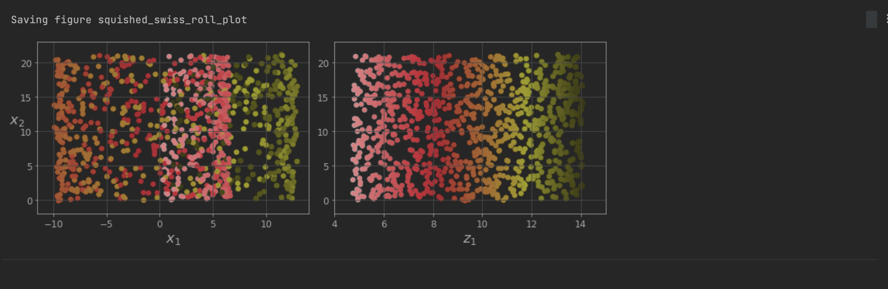
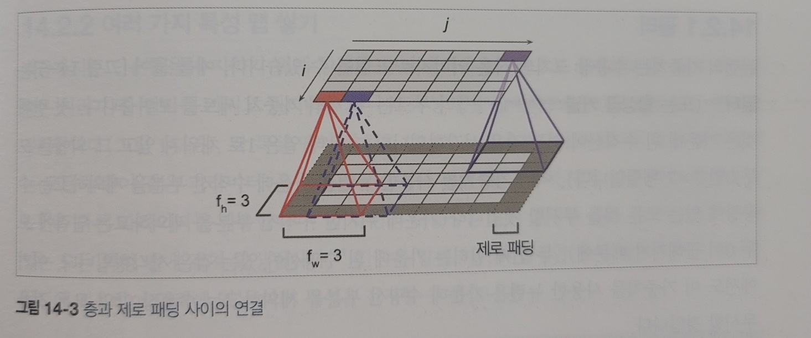

# 핸즈온 머신러닝
> 사이킷런, 케라스, 텐서플로2를 활용한 머신러닝, 딥러닝 완벽 실무

{width="500" height="700"}


## 2장 요약

* 유명한 공개 데이터 저장소
	- UC 얼바인 머신러닝 저장소
	- 캐글 데이터셋
	- 아마존 AWS 데이터셋
	- 데이터 포털
	- 오픈 데이터 모니터
	- 퀀들
	- 위키백과 머신러닝 데이터셋 목록
	- Quora.com
	- 데이터셋 서브레딧
	- StatLib
* 성능 측정 지표 선택
	- 회귀 문제의 전형적인 성능 지표는 평균 제곱근 오차 root mean square error (RMSE)를 사용한다
	- 하지만 이상한 데이터가 많다면 평균 절대 오차(평균 절대 편차)를 사용하기도 한다
	- 이 두가지 방법 모두 예측값의 벡터와 타깃값의 벡터 사이의 거리를 재는 방법이다.
	- 여러가지 norm 방법
		+ 유클리디안 norm: 제곱근을 합한 것의 제곱근
		+ 맨해튼 norm: 절댓값의 합을 계산
* 계층 샘플링으로 테스트 데이터셋 만들기
	- 일반 무작위 샘플링으로 만든 테스트 세트와 계층 샘플링을 사용해 만든 테스트 세트의 분포, 비율이 많이 다르다
  > 이게 중요한 이유는 예를들면, 설문조사 기관에서 1000명에게 질문을 몇 개 하려할때, 그냥 전화번호부에서 1000명을 뽑으면 결과를 편향시킬 수 있다.
  전체 인구를 대표하는 1000명을 뽑기 위해서 노력할텐데..예를 들면 미국 인구의 남성이 51.3%, 여성이 48.7%라면 잘 구성된 설문조사는 샘플에서도 이 비율을 유지할 것이다.
	- 따라서 여기서는 중위 소득 카테고리를 기반으로 '계층 샘플링'하는 방법을 보여준다
	- 사이킷런의 `StratifiedShuffleSplit`을 사용한다

{width="800" height="400"}
> 그리고 이미지 위에 차트를 띄울 수도 있다. 주택가격 같은 위경도를 포함한 데이터에서 유용해보인다
x,y좌표를 위,경도로 두고 밀집도를 원의 크기, 주택 가격을 colorbar로 두어서 4가지 데이터를 2d 그래프 위에 표현하였다


* 상관계수 산정 방식 (corr)
	- 피어슨 상관계수
	- 켄달-타우 상관계수
	- 스피어먼 상관계수

{width="800" height="200"}

상관계수는 선형적인 상관관계만 측정한다. 비선형적인 관계는 측정할 수 없다
상관계수는 기울기와 상관없다. 두번째 row 그림을 보면 기울기가 달라도 상관계수는 같을 수 있다

1에 가까울수록 양의 상관관계, -1에 가까울수록 음의 상관관계, 0에 가까울수록 선형적인 상관관계가 없다는 뜻


1. 데이터 정제
	* 해당 row 제거 -> dropna()
	* 해당 column 제거 -> drop()
	* 어떤 값을 채움 (0, 평균, 중간값 등) -> fillna()
2. Transformer
	* SimpleImputer: 누락된 값을 strategy에 따라 쉽게 다룰 수 있음
	* OrdinalEncoder: 카테고리 텍스트(범주형 데이터)를 숫자로 변경
	* OneHotEncoder: 이진 특성을 만들어줌
		- 카테고리 특성이 많다면 이 방법은 느림. 각 카테고리를 그 특성을 표현하는 숫자형 데이터로 바꿈 -> 임베딩
	* CombinedAttributesAdder
	* BaseEstimator
	* TransformerMixin
	* Pieline
	* StandardScaler
	* ColumnTransformer
3. Model
	* from sklearn.linear_model import LinearRegression
	* from sklearn.tree import DecisionTreeRegressor
	* from sklearn.ensemble import RandomForestRegressor
	* from sklearn.svm import SVR
4. Fine-Tune
	* from sklearn.model_selection import GridSearchCV
	* from sklearn.model_selection import RandomizedSearchCV


## 3장 요약. 분류

* 성능 측정
	* 오차 행렬
		- `from sklearn.metrics import confusion_matrix`
	+ classifier에서는 성능 평가에 정확도 대신 사용하는 방법 (클래스 A 샘플이 클래스 B로 분류된 횟수를 세는 것)
		* precision, recall, f1_score
			- `from sklearn.metrics import precision_score, recall_score`
			- `from sklearn.metrics import f1_score`
		* ROC 곡선, 곡선 아래의 면적 AUC
			- `from sklearn.metrics import roc_auc_score`
* 다중 분류
* 에러 분석
	- 오차 행렬 시각화하기
* 다중 레이블 분류
* 다중 출력 분류

```python
from sklearn.linear_model import SGDClassifier
from sklearn.model_selection import StratifiedKFold
from sklearn.metrics import precision_score, recall_score
from sklearn.metrics import f1_score
from sklearn.metrics import precision_recall_curve
from sklearn.metrics import roc_curve
from sklearn.metrics import roc_auc_score
from sklearn.ensemble import RandomForestClassifier
from sklearn.svm import SVC
from sklearn.multiclass import OneVsRestClassifier
from sklearn.preprocessing import StandardScaler
from sklearn.neighbors import KNeighborsClassifier
```

## 4장 요약. 모델 훈련

생략


## 5장 요약. 서포트 벡터 머신 SVM

서포트 벡터 머신(SVM : Support Vector Machine)이란 두 클래스로부터 최대한 멀리 떨어져 있는 결정 경계를 찾는 분류기로 특정 조건을 만족하는 동시에 클래스를 분류하는 것을 목표로 합니다. 결정 경계를 통해 어느 쪽에 속하는지 판단하는 것으로, 선형이나 비선형 분류, 회귀, 이상치 탐색에도 사용할 수 있는 강력한 성능을 갖는 지도 학습 모델입니다. 특히, 복잡한 분류에 잘 들어맞으며 데이터셋이 작거나 중간 크기에 적합합니다.

* 라지 마진 분류, 소프트 마진 분류
* 서포트 벡터: 경계에 위치한 샘플
* 도로 바깥쪽에 훈련 샘플을 더 추가해도 결정 경계는 영향을 받지 않는다


SVM 알고리즘은 다양한 상황에 사용 가능

* 선형 분류
* 비선형 분류
	- 다항 특성 추가
	- 유사도 함수
	- 가우시안 RBF 커널
* 선형 회귀
* 비선형 회귀

> 커널 트릭에서 중요한건, LinearSVC 이렇게 사용할 수도 있지만, SVC(kernel="linear") 이렇게도 쓸 수 있다는 것

회귀에 적용하는 방법은
일정한 마진 오류 안에서 두 클래스 간의 도로 폭이 가능한 최대가 되도록 하는 것(분류와는 목표가 반대)
제한된 마진 오류(도로밖의 샘플) 안에서 도로 안에 가능한 한 많은 샘플이 들어가도록 학습하는 것


## 6장 요약. 결정트리

* 화이트박스
* 블랙박스

CART 훈련 알고리즘

gini 불순도

파라미터 수를 제한하는 것은, 매개변수를 규제하는 것은 과대적합(너무 훈련 데이터에 가깝게 맞추려는 경향)을 막아준다. 반대로 과소적합될 확률은 높아진다

* 비파라미터 모델
* 파라미터 모델

파라미터 종류 참고
> 파라미터를 보면 모델의 내부 구조를 예상해볼 수 있다

* max_depth 							트리의 최대 깊이
* min_samples_split 					분할되기 위해 노드가 가져야할 최소 샘플 수
* min_samples_leaf 					리프 노드가 가지고 있어야할 최소 샘플 수
* min_weight_fraction_leaf 		min_samples_leaf와 같지만 가중치가 부여된 전체 샘플 수에서의 비용
* max_leaf_noes 						리프 노드의 최대 수
* max_features 						각 노드에서 분할에 사용할 특성의 최대 수


회귀 모델 역시 결정 트리를 만듭니다.
CART 알고리즘은 훈련 세트를 분순도를 최소화하는 방향으로 분할하는 대신 평균제곱오차 MSE를 최소화하도록 분할하는 것이 다릅니다.


## 7장 요약. 앙상블과 랜덤 포레스트

* 직접 투표
	- 각 분류기의 예측을 모아서 가장 많이 선택된 클래스를 선택
* 간접 투표
	- 개별 분류기의 예측을 평균 내어 확률이 가장 높은 클래스를 예측

> 앙상블은 가능한 예측기가 서로 독립적일때 가장 큰 효과를 발휘. 같은 종류의 데이터셋으로 학습하면 같은 종류의 오차를 만들 확률이 커짐

* 배깅과 페이스팅
	- 배깅 bootstrap aggregating
		+ 훈련 세트에서 중복을 허용하여 샘플링
	- 페이스팅 pasting
		+ 중복을 허용하지 않고 샘플링
* 부스팅
	- 에이다부스팅 AdaBoost. adaptive boosting
		+ 잘못 예측된 샘플에 대한 가중치를 높여서 다음 학습을 진행
	- 그레이디언트 부스팅 gradient boosting
		+ 이전 예측기의 잔여 오차를 새로운 예측기에서 학습
* 스태킹
	- 블랜더


## 8장 요약. 차원 축소

* 투영
	- 투영
		+ 3D 차원을 2D 차원으로 투영하기
		+ 스위스 롤
	- 매니폴드 학습
* PCA. 데이터를 가장 가까운 초평면 hyperplan 을 정의하고 데이터를 이 평면에 투영
	- 분산 보존
		+ 투영하는 축, 방향 중에서 분산이 최대한 보존되는 것을 선택하는게 정보 손실이 가장 적다
			* 원본 데이터셋과 투영된 것 사이의 평균 제곱 거리를 최소화하는 축
	- 주성분 principal component PC
		+ PCA는 훈련 세트에서 분산이 최대인 축을 찾습니다
		+ 첫 번째 축에 직교하고 남은 분산을 최대한 보존하는 두번째 축을 찾습니다
		+ 이전의 두 축에 직교하는 세번째 축을 찾습니다
		+ 이런 식으로 n번째 축까지 찾습니다
		+ i번째 축을 이 데이터의 i번째 주성분이라고 합니다
	- d차원으로 투영하기
* 적절한 차원 수 찾기
	- 훈련 세트의 분산을 95%로 유지하는데 필요한 최소한의 차원 수를 계산
	- 분산을 차원 수에 대한 함수로 그리는 것
* PCA 방법
	- 랜덤 PCA
	- 점진적 PCA
	- 커널 PCA
* 비선형 차원 축소
	- 지역 선형 임베딩 LLE


## 9장 요약. 비지도 학습

분류와 달리 군집은 비지도 학습

- 사용 사례
	+ 고객 분류
	+ 데이터 분석
	+ 차원 축소 기법
	+ 이상치 탐지
	+ 준지도 학습
	+ 검섹 엔진
	+ 이미지 분할

* 군집
	- k-mean
		+ 센트로이드: 클러스터 중심
		+ k-mean 알고리즘 동작 방식
			* 처음에는 무작위로 센트로이드를 선정한다
			* 샘플에 레이블을 할당하고 센트로이드를 업데이트하고를 반복
			* 센트로이드에 변화가 없을때까지 반복
		+ 센트로이드 초기화
			* 랜덤 초기화를 여러번 수행해서 가장 좋은 솔루션을 선택
			* 성능지표: 각 샘플과 가장 가까운 센트로이드 사이의 평균 제곱 거리이며 모델의 이너셔 inertia
			* k-mean++ 알고리즘
		+ 최적의 클러스터 수 찾기
			* 이너셔, 실루엣 점수
		+ 개선 버전
			* k-mean 속도 개선
				- 불필요한 거리 계산을 많이 피함으로써 알고리즘의 속도를 향상시킴. 삼각부등식을 사용
				- > KMeans 클래스의 기본 알고리즘
			* 미니배치 k-mean
				- 반복에 전체 데이터셋을 사용하는게 아니라, 각 반복마다 미니배치를 사용해 센트로이드를 조금씩 이동
				- > MiniBatchKmeans 클래스의 알고리즘
		+ 장점
			* 속도가 빠르고, 확장이 용이
		+ 단점
			* 최적 솔루션을 찾으려면 여러번 실행해야함. 클러스터 개수를 지정해야함
			* 클러스터의 크기가 밀집도가 원형이 아닐 경우 (시각화했을때 그 모양이) 잘 작동하지 않는다
	- DBSCAN
	- 다른 모델
		+ 병합 군집 agglomerative clustering
		+ BIRCH balanced iterative reducing and clustering using hierachies
		+ 평균-이동 mean-shift
		+ 유사도 전파 affinity propagation
		+ 스펙트럼 군집 spectral clustering
* 가우시안 혼합 모델 Gaussian mixture model GMM
	- 로직 (k-mean과 유사)
		+ 기댓값-최대화 expectation-maximization EM 알고리즘을 사용한다고 한다
		+ 먼저 샘플을 클러스터에 할당 (기댓값 단계)
		+ 클러스터를 업데이트 (최대화 단계)
	- convaiance_type 하이퍼파라미터 (클러스터의 모양, 지름, 분산 등이 다르다)
		+ full, spherical, diag, tied
	- 이상치 탐지, 특이치 탐지
		+ 밀도가 낮은 지역에 있는 샘플들을 '이상치'로 분류하여 이상치 탐지에 사용
	- 클러스터 개수 선택하기
		+ BIC, AIC와 같은 이론적 정보 기준을 최소화하는 모델을 찾는다
		+ 베이즈 가우시안 혼합 모델
	- 다른 모델
		+ PCA, Fast-MCD, 아이솔레이션 포레스트, LOF, one-class SVM

## 10장 요약. 케라스를 사용한 인공 신경망 소개

* 입력층, 은닉층, 출력층
* 역전파를 사용한 인공 신경망 학습 방법
	- > 정방향 계산(예측) -> 역방향 계산(오차에 기여한 정도 계산) -> 경사 하강법(오차가 감소하도록 가중치 조절)
* 신경망 모델을 만드는 다양한 방법
	- 시퀀셜 API
	- 함수형 API
	- 서브클래싱 API (동적 모델)
	- 콜백, 조기 종료
* 모델 사용하기
	- save, load
	- 텐서보드
* 하이퍼파라미터 튜닝
	- 은닉층 개수
	- 은닉층의 뉴런 개수
	- 학습률
	- 옵티마이저
	- 배치 크기
	- 활성화 함수
	- 반복 횟수 (or 조기 종료)


## 11장 요약. 심층 신경망 훈련하기

* 큰 신경망 모델에서 흔히 발생하는 문제들
	- 그레이디언트 소실, 그레이디언트 폭주 문제
	- 레이블을 만드는 작업의 비용 증가
	- 훈련이 극단적으로 느려짐
	- 수백만개의 파라미터를 가진 모델을 과대적합될 위험이 크다 (과대적합 -> 규제)

* 그레이디언트 소실, 그레이디언트 폭주 문제
	- 소실
		+ 초기화 전략
		+ 활성화 함수
		+ 배치 정규화 BN
	- 폭주
		+ 그레디이언트 클리핑
* 레이블을 만드는 작업의 비용 증가
	- 사전훈련된 층 재사용하기 (전이 학습)
	- 비지도 사전훈련
	- 보조 작업에서 사전훈련
* 훈련이 극단적으로 느려짐
	- 모멘텀 최적화
	- 네스테로프 가속 경사
	- AdaGrad
	- RMSProp
	- Adam과 Nadam 최적화
	- 학습률 스케줄링
		+ 거듭제곱 기반 스케줄링
		+ 지수 기반 스케줄링
		+ 구간별 고정 스케줄링
		+ 성능 기반 스케줄링
		+ 1사이클 스케줄링
* 수백만개의 파라미터를 가진 모델을 과대적합될 위험이 크다 (과대적합 -> 규제)
	- l1과 l2 규제
	- 드롭아웃
	- 몬테 카를로 드롭아웃
	- max-norm 규제


## 12장 요약. 텐서플로를 사용한 사용자 정의 모델과 훈련

텐서는 넘파이의 ndarray와 유사하고, 서로 변환될 수 있다
넘파이는 64비트 부동소수를 사용하고, 텐서플로는 32비트 부동소수를 사용한다

## 13장 요약. 텐서플로에서 데이터 적재와 전처리하기

* 아주 큰 데이터셋을 로드하는 방법
	- 데이터 API
		+ 데이터셋 객체를 만들고, 데이터를 읽어 올 위치와 변환 방법만 알려주면
		+ 멀티스레딩, 큐, 배치, prefetch 등을 알아서 설정해준다
		+ 지원하는 데이터
			* 텍스트, csv
			* 고정 길이 레코드의 이진 파일
			* TFRecord
				- protocol buffer
* 숫자 데이터가 아닌 데이터들을 전처리하는 방법
	- 데이터 정규화가 필요
	- 텍스트 feautre, 범주형 feature -> 수치형 필드
		+ 원-핫 인코딩, BoW 인코딩, 임베딩

## 14장 요약. 합성곱 신경말을 사용한 컴퓨터 비전

* CNN convolutional neural network
	- 객체 탐지
	- 바운딩 박스
	- 시멘틱 분할
* CNN 구성 요소
	- 합성곱 층 convolutional layer
	- 제로 패딩 zero padding
	- 스트라이드 stride
	- 수용장 receptive field
	- 필터 filter
	- 특성 맵 feature map
	- 풀링 층 pooling layer. 파라미터 수를 줄이기 위해 입력 이미지의 subsample을 만드는 역할
* 전형적인 CNN 구조
	- 합성곱 layer
	- 풀링 layer
	- 합성곱 layer (+ReLU)
	- 풀링 layer


## 15장 요약. RNN과 CNN을 사용해 시퀀스 처리하기
## 16장 요약. RNN과 어텐션을 사용해 자연어 처리
## 17장 요약. 오토 인코더와 GAN을 사용한 표현 학습과 생성적 학습
## 18장 요약. 강화 학습

## 19장 요약. 대규모 텐서플로 모델 훈련과 배포

* 텐서플로 모델 서빙 (TF Serving)
* GCP에서 해본다면 (AI Platform)
	- GCS에 SavedModel 파일 업로드
	- 모델 만들기
	- 버전 만들기
* 모바일, 임베디드 배포가 필요하다면
	- 경량 모델 사용 (TLLite)
	- 모델 가중치를 고정 소수점인 8비트 정수로 압축 (32비트 실수보다 4배 크기가 감소)
	- post-training quantization 훈련 후 양자화
	- quantization-aware training 양자화를 고려한 훈련
* GPU
	- colab
* 다중 장치에서 모델 훈련하는 방법
	- 모델 병렬화
	- 데이터 병렬화
	- 분산 전략 API를 사용한 대규모 훈련
	- 텐서플로 클러스터에서 모델 훈련
	- 구글 클라우드 AI 플랫폼에서 대규모 훈련 실행하기
	- AI 플랫폼에서 블랙 박스 하이퍼파라미터 튜닝


## 2장. 머신러닝 프로젝트 처음부터 끝까지

어떤식으로 진행해야할까?
* 큰 그림을 봅니다
* 데이터를 구합니다
* 데이터로부터 통찰을 얻기 위해 탐색하고 시각화합니다
* 머신러닝 알고리즘을 위해 데이터를 준비합니다
* 모델을 선택하고 훈련시킵니다
* 모델을 상세하게 조정합니다
* 솔루션을 제시합니다
* 시스템을 론칭하고 모니터링하고 유지 보수합니다

### 2.1 실제 데이터로 작업하기

* 유명한 공개 데이터 저장소
	- UC 얼바인 머신러닝 저장소
	- 캐글 데이터셋
	- 아마존 AWS 데이터셋
* 메타 포털
	- 데이터 포털
	- 오픈 데이터 모니터
	- 퀀들
* 인기 있는 공개 데이터 저장소가 나열되어 있는 다른 페이지
	- 위키백과 머신러닝 데이터셋 목록
	- Quora.com
	- 데이터셋 서브레딧

여기서는 StatLib 저장소에 있는 캘리포니아 주택 가격 데이터셋을 사용

### 2.2 큰 그림을 봅니다

#### 2.2.1 문제 정의

"비즈니스의 목적이 정확히 뭔가요?"
모델 만들기가 아니다. 모델을 사용해 어떻게 이익을 낼 것인가?

현재 구역 주택 가격을 전문가가 수동으로 예측
따라서 구역의 데이터를 기반으로 중간 주택 가격을 예측하는 모델을 훈련시키는 것이 유용하다고 판단

* 레이블된 훈련 샘플이 있으니 전형적인 지도 학습 작업이다
* 값을 예측해야 하므로 전형적인 회귀 문제이다
* 예측에 사용할 특성이 여러개(구역의 인구, 중간 소득 등)이므로 다중 회귀 문제이다
* 각 구역마다 하나의 값을 예측하므로 단변량 회귀 문제이다
* 데이터가 작고 빠르게 적응하지 않아도 되므로 배치 학습이 적절하다
	- 데이터 크다면 맵리듀스

#### 2.2.2 성능 측정 지표 선택

회귀 문제의 전형적인 성능 지표는 평균 제곱근 오차 root mean square error (RMSE)를 사용한다
하지만 이상한 데이터가 많다면 평균 절대 오차(평균 절대 편차)를 사용하기도 한다

이 두가지 방법 모두 예측값의 벡터와 타깃값의 벡터 사이의 거리를 재는 방법이다.
여러가지 norm 적용이 가능하다

* 유클리디안 norm: 제곱근을 합한 것의 제곱근
* 맨해튼 norm: 절댓값의 합을 계산

#### 2.2.3 가정 검사

가격 예측 모델을 만들었는데, 하위 서비스에서 가격이 아닌 '저렴', '보통', '고가' 같은 카테고리로 서비스한다면..
이는 분류 문제이다

따라서 실제로 무엇이 필요한지 파악하는건 중요하다

### 2.3 데이터 가져오기

> ch2. notebook 참고

1. 작업환경 만들기
2. 데이터 다운로드
3. 데이터 구조 훑어보기
4. 테스트 세트 만들기

전체 데이터셋에서 train 데이터셋과 test 데이터셋을 나누는 여러가지 방법이 있다

* 단순히 랜덤하게 20%의 데이터셋을 test 데이터셋으로 분리
	- 이렇게 하면 다음번 실행에서 test 데이터셋이 항상 달라진다
* 난수를 고정 `np.random.seed(42)`
	- 다음번 업데이트된 데이터셋에서 달라짐
* 샘플의 식별자를 사용해서 필터링
	- 식별자의 해시값을 사용. ex `crc32(np.int64(identifier)) & 0xffffffff < test_ratio * 2**32`
	- 경도 + 위도를 이은 값을 식별자로 사용
* 사이킷런의 함수를 사용
	- `from sklearn.model_selection import train_test_split`

일반 무작위 샘플링으로 만든 테스트 세트와 계층 샘플링을 사용해 만든 테스트 세트의 분포, 비율이 많이 다르다
> 이게 중요한 이유는 예를들면, 설문조사 기관에서 1000명에게 질문을 몇 개 하려할때, 그냥 전화번호부에서 1000명을 뽑으면 결과를 편향시킬 수 있다.
전체 인구를 대표하는 1000명을 뽑기 위해서 노력할텐데..예를 들면 미국 인구의 남성이 51.3%, 여성이 48.7%라면 잘 구성된 설문조사는 샘플에서도 이 비율을 유지할 것이다.

따라서 여기서는 중위 소득 카테고리를 기반으로 '계층 샘플링'하는 방법을 보여준다
사이킷런의 `StratifiedShuffleSplit`을 사용한다

```python
housing["income_cat"] = pd.cut(housing["median_income"],
                               bins=[0., 1.5, 3.0, 4.5, 6., np.inf],
                               labels=[1,2,3,4,5])

housing["income_cat"].value_counts()

from sklearn.model_selection import StratifiedShuffleSplit

split = StratifiedShuffleSplit(n_splits=1, test_size=0.2, random_state=42)
for train_index, test_index in split.split(housing, housing["income_cat"]):
    strat_train_set = housing.loc[train_index]
    strat_test_set = housing.loc[test_index]
```

{width="800" height="150"}


### 2.4 데이터 이해를 위한 탐색과 시각화


Matplot을 사용하여 더 효과적인 시각화 차트를 그리는게 가능
> cmap = color map. 다양한 팔레트 조합을 지원
[Matplot Color Map 종류 (Cmap)](https://jrc-park.tistory.com/155)


{width="800" height="400"}
{width="800" height="400"}
{width="800" height="550"}


그리고 이미지 위에 차트를 띄울 수도 있다.
주택가격 같은 위경도를 포함한 데이터에서 유용해보인다

x,y좌표를 위,경도로 두고 밀집도를 원의 크기, 주택 가격을 colorbar로 두어서 4가지 데이터를 2d 그래프 위에 표현하였다

{width="800" height="400"}


#### 2.4.2 상관계수 조사

[피어슨 상관계수]
피어슨 상관계수는 두 변수 간의 선형 상관관계를 계량화 한 수치입니다. 코시-슈바르츠 부등식에 의해 +1과 -1사이의 값을 가집니다.
+1의 경우 완벽한 양의 선형 상관 관계, -1의 경우 완벽한 음의 상관관계, 0의 경우 선형 상관관계를 갖지 않습니다.

> 상관계수 산정 방식에는 피어슨 상관계수, 켄달-타우 상관계수, 스피어먼 상관계수를 사용합니다.

{width="800" height="200"}

{width="800" height="400"}

중간 주택 가격 - 중간 소득 간에 상관관계가 가장 유용해보임
하지만 수평선들이 간혹 보임. 알고리즘이 이런 이상한 데이터를 학습하지 않도록 해당 구역을 제거하는 것이 좋음

#### 2.4.3 특성 조합으로 실험. feature

* 위 과정을 통해 얻은 여러가지 아이디어
	- 정제해야할 조금 이상한 데이터를 확인했고
	- 특정 사이의 흥미로운 상관관계를 확인했고
	- 꼬리가 두꺼운 특성은 데이터를 변형해야겠고 (ex. 로그스케일로)
	- ...

기존 데이터에 없는 특성, feature를 정해서 다시 상관계수를 구해봅니다.
* rooms_per_household: 가구당 방 수
* bedrooms_per_room: 방당 침실 수
* population_per_household: 인구당 가구수

프로토타이핑을 빨리하고, insight를 얻은 뒤 이 과정을 반복합니다.

### 2.5 머신러닝 알고리즘을 위한 데이터 준비

1. 데이터 정제
	* 해당 row 제거 -> dropna()
	* 해당 column 제거 -> drop()
	* 어떤 값을 채움 (0, 평균, 중간값 등) -> fillna()
2. 유용한 변환기
	* SimpleImputer: 누락된 값을 strategy에 따라 쉽게 다룰 수 있음
	* OrdinalEncoder: 카테고리 텍스트(범주형 데이터)를 숫자로 변경
	* OneHotEncoder: 이진 특성을 만들어줌
		- 카테고리 특성이 많다면 이 방법은 느림. 각 카테고리를 그 특성을 표현하는 숫자형 데이터로 바꿈 -> 임베딩
	* CombinedAttributesAdder
	* BaseEstimator
	* TransformerMixin
	* Pieline
	* StandardScaler
	* ColumnTransformer
		- 각 칼럼에 다른 변환기를 붙일 수 있음
		- 정수형 변환기 / 범주형 변수(카테고리)를 나눠서


{width="800" height="400"}


파이썬 리스트와 크게 다른점중의 하나는 배열 슬라이스는 새로운 객체를 만드는 것이 아닌 원래 배열에 대한 뷰(view)이다. 즉 선택 부분의 값을 변경하면 원래 배열의 같은 위치의 값도 변경이 되는 것이다.

배열의 일부분을 복사해서 사용하려면 copy 메소드를 이용할 수 있다.

연속변수와 이산변수
* Continuous variable (연속변수): 무한한 값을 취할 수 있는 변수 (ex. 체중, 수입)
* Discrete variable (이산변수): 취할 수 있는 값이 유한한 변수. (ex. 성별, 자녀 수)
* Categorical varialbe (범주형변수): 취하는 값이 숫자의 크기가 아닌 그룹의 이름을 지칭하는 변수. (ex. 성별)


### 2.6 모델 선택과 훈련

* from sklearn.linear_model import LinearRegression
* from sklearn.metrics import mean_squared_error
* from sklearn.tree import DecisionTreeRegressor
* from sklearn.model_selection import cross_val_score
	- 교차 검증을 통해서 모델의 성능 뿐만 아니라 이 추정이 얼마나 정확한지(표준편차를 통해) 알 수 있습니다.
* from sklearn.ensemble import RandomForestRegressor
* from sklearn.svm import SVR

{width="800" height="700"}

모델의 fit_transform 메서드로
들어가는건 pandas DataFrame
나오는건 numpy.ndarray


### 2.7 모델 세부 튜닝. Find-Tune

* from sklearn.model_selection import GridSearchCV
* from sklearn.model_selection import RandomizedSearchCV
* from scipy.stats import randint
* from scipy import stats


* import joblib
* from scipy.stats import geom, expon
* from scipy.stats import expon, reciprocal


## 3장. 분류


MNIST 데이터셋을 이용해서 분류문제를 해결해봅니다.

matplotlib을 이용해서
* MNIST 이미지들을 보여주거나
* precision/recall 그래프
* ROC, AUC 그래프
  를 그리는 코드들이 있습니다.

matplotlib을 사용할 때 주로 서브패키지인 pyplot을 사용한다.

Figure : matplotlib은 한 번에 한장의 그림을 그린다. 이 그림을 가리키는 용어가 figure이다. figure는 그림을 그리는 캔버스로 생각할 수 있으며, 하나의 figure에는 여러 개의 plot이 들어갈 수 있다. plot이 하나의 차트에 해당한다. (그런데….?)
Axes : 보통 plot으로 생각하는 하나의 그래프. 각각의 Axes는 개별적으로 제목 및 x/y 레이블을 가질 수 있다. (왜 플롯이나 차트라고 하지 않는지…)
Axis : 번역하면 ‘축’인데, 그려지는 축을 말하는 것이 아니라 정확히는 x, y 의 제한 범위를 말한다.
Artist : Figure 위에 그려지는 모든 것들은 각각 artist라 한다. 텍스트, 라인 같은 것들. 이들 대부분은 자신이 그려지는 Axes에 묶여 있다고 볼 수 있다.

{width="800" height="350"}


### 3.2 이진 분류기 훈련

여기서는 우선 문제를 단순화해서 숫자가 5인지 아닌지만을 분류하는 이진 분류기 binary classifier를 구현합니다.
사용하는 모델은 확률적 경사 하강법 Stochastic Gradient Descent SGD

### 3.3 성능 측정

회귀 모델과 분류 모델은 성능 측정에 어떤 차이가 있을까?

* 교차 검증
	- StratifiedKFold
		+ 클래스별 비율이 유지되도록 폴드를 만드는 계층적 샘플링을 수행
	- corss_val_score

막상 해보면 정확도가 매우 높다. 이는 정답 자체가 10가지 종류밖에 안되기 때문에, 무조건 5가 아님.으로 예측하면 정확도 90%를 달성할 수 있습니다.
이게 classifier 모델에서 정확도를 성능 측정 지표로 사용하지 않는 이유입니다.

### 3.2 오차 행렬

classifier에서는 성능 평가에 이런 방법들을 사용합니다.
* 오차행렬
	- 클래스 A 샘플이 클래스 B로 분류된 횟수를 세는 것
	- `from sklearn.model_selection import cross_val_predict`
	- `from sklearn.metrics import confusion_matrix`
* precision, recall, f1_score
	- `from sklearn.metrics import precision_score, recall_score`
	- `from sklearn.metrics import f1_score`
* ROC 곡선, 곡선 아래의 면적 AUC
	- `from sklearn.metrics import roc_auc_score`


오차행렬을 통해서 precision, recall, f1_score를 구할 수 있다.
물론 sklearn 함수를 사용해서도 구할 수 있다

precision과 recall은 서로 트레이드오프가 있다

{width="800" height="350"}

어느정도의 재현율, 정밀도를 선택하느냐는 서비스에 따라 다르겠지만, 급격히 그래프가 꺽이는 부분을 선택할 수도 있을 것이다.

정밀도/재현율 트레이드오프를 선택하는 또다른 방법은 재현율에 대한 정밀도 곡선을 그리는 것이다

{width="800" height="350"}


ROC 곡선으로 비교해보면
랜덤 포레스트 분류기가 SGD에 비해, 곡선 아래 면적 AUC가 큽니다. 성능이 좋다는 뜻입니다.


{width="800" height="400"}


### 3.4 다중 분류. Multiclass Classification

둘 이상의 클래스를 구별할 수 있다.

SGD 분류기, 랜덤 포레스트 분류기, 나이브 베이즈 분류기 같은 일부 알고리즘은 여러 개의 클래스를 직접 처리할 수 있지만,

> * 나이브 베이즈 Naive Bayes
	- 베이즈 정리를 적용한 조건부 확률 기반의 분류 모델. 조건부 확률이란 '무료라는 단어가 들어있을때 스팸일 확률'

로지스틱 회귀나 서포트 벡터 머신 SVM 분류기 같은 알고리즘은 이진 분류만 가능하다.

이진 분류기를 통해서 여러 클래스를 분류하는 방법
* OvR, OvA 전략 (대부분 선택)
	- one-versus-the-rest
	- one-versus-all
	- 특정 숫자 하나만 구분하는 이진 분류기 10개를 훈련시켜서 10개 클래스에 대한 결정 점수를 각각 구하는 전략
	- 결정 점수가 가장 높은 것을 선택
* OvO 전략
	- one-versus-one
	- 각 숫자의 조합마다 이진 분류기를 학습. 0과 1구별, 0과 2구별, 1과 2구별 등등
	- 클래스가 N개면 N * (N-1) / 2 개의 분류기가 필요 (MNIST에서는 45개)
	- 가장 많이 양성으로 분류된 클래스를 선택

### 3.5 에러 분석

실제 프로젝트라면..
* 데이터 준비
* 가능한 선택 사항 탐색
* 여러 모델 시도
* 가장 좋은 몇개를 골라 GridSearchCV로 하이퍼파라미터 튜닝
* 반복..자동화

이런식으로 프로젝트를 진행할 것이다.

여기서는 에러의 종류를 분석해서 모델의 성능을 향상시킬 수 있는 방법은 본다

오차 행렬을 시각화하여 어떤 숫자가 어떤 다른 숫자로 많이 예측이 되는지(틀리는지)
숫자의 어떤 특성이 오차를 내게끔 하는지를 보면서 인사이트를 얻는다

matplotlib의 matshow() 함수로 오차 행렬을 이미지화 할 수 있다

{width="800" height="200"}

> 보면 숫자 5가 좀 어두운데, 5에 대해서 잘 추론을 하지 못하고 있는 것을 볼 수 있다
> 그리고 8 열이 밝은데, 많은 숫자들이 8로 잘못 분류되고 있다는 것을 알 수 있다

{width="800" height="550"}

이런식으로 3과 5에 대해서 3인데 3으로 추론된 데이터, 3인데 5로 추론된 데이터, 5인데 5로 추론된 데이터, 5인데 3으로 추론된 데이터를 시각화해서 볼 수 있다


### 3.6 다중 레이블 분류

각 샘플이 하나의 클래스에만 할당되는게 아니라 샘플도 여러개의 클래스에 할당되는 경우
ex. 얼굴 표정

여기서는 두 개의 타깃 레이블이 담긴 y_multilabel 배열을 만듭니다.
큰 숫자인지 판별 + 홀수인지 판별

```python
from sklearn.neighbors import KNeighborsClassifier

y_train_large = (y_train >= 7)
y_train_odd = (y_train % 2 == 1)
y_multilabel = np.c_[y_train_large, y_train_odd]

knn_clf = KNeighborsClassifier()
knn_clf.fit(X_train, y_multilabel)
knn_clf.predict([some_digit])

# 결과 측정
y_train_knn_pred = cross_val_predict(knn_clf, X_train, y_multilabel, cv=3)
f1_score(y_multilabel, y_train_knn_pred, average="macro")
```


### 3.7 다중 출력 분류

다중 레이블 분류에서 한 레이블이 다중 클래스가 될 수 있도록 일반화한것

여기서는 이미지의 잡음을 제거하는 시스템을 만듭니다
분류기의 출력이 다중 레이블(픽셀당 한 레이블)       <- 다중 레이블
각 레이블은 값을 여러개 가집니다(0부터 255)       <- 다중 클래스

> 이 예에서처럼 분류와 회귀의 경계는 때로 모호합니다. 픽셀의 강도는 회귀 문제처럼 보이기도 합니다.

```python
noise = np.random.randint(0, 100, (len(X_train), 784))
X_train_mod = X_train + noise
noise = np.random.randint(0, 100, (len(X_test), 784))
X_test_mod = X_test + noise
y_train_mod = X_train
y_test_mod = X_test

some_index = 0
plt.subplot(121); plot_digit(X_test_mod[some_index])
plt.subplot(122); plot_digit(y_test_mod[some_index])
save_fig("noisy_digit_example_plot")
plt.show()

knn_clf.fit(X_train_mod, y_train_mod)
clean_digit = knn_clf.predict([X_test_mod[some_index]])
plot_digit(clean_digit)
save_fig("cleaned_digit_example_plot")
```

코드가 잘 이해는 안되지만, 이미지 자체(이미지도 픽셀들의 연속된 숫자 배열이니..)에 랜덤 숫자 배열을 더한다
이렇게 노이즈가 낀 숫자 배열을 기존의 깔끔한 숫자 배열로 추론하도록 fit 시킨다

{width="800" height="200"}


### 3장 연습문제

정확도를 더 높여보는 여러가지 도전을 해본다

* 모델을 KNeighborsClassifier 사용하는 작업
* GridSearchCV를 사용해서 파인튜닝, 최적의 하이퍼파라미터를 찾는 작업
* 이미지를 Shirt 시켜본 이미지를 추가로 학습시키는 작업

```python
from sklearn.model_selection import GridSearchCV
from sklearn.neighbors import KNeighborsClassifier

X_train, X_test, y_train, y_test = X[:60000], X[60000:], y[:60000], y[60000:]

param_grid = {'weights': ['uniform', 'distance'], 'n_neighbors': [1,2,3,4,5,6]}

knn_clf = KNeighborsClassifier()

grid_search = GridSearchCV(knn_clf, param_grid, cv=5, verbose=3)
grid_search.fit(X_train, y_train)

grid_search.best_params_
grid_search.best_score_

from sklearn.metrics import accuracy_score

grid_search_pred = grid_search.predict(X_test)
accuracy_score(y_test, grid_search_pred)
```

이미지 쉬프트

```python
from scipy.ndimage.interpolation import shift

def shift_image(image, dx, dy):
    image = image.reshape((28, 28))
    shifted_image = shift(image, [dy, dx], cval=0, mode="constant")
    return shifted_image.reshape([-1])

image = X_train[1000]
shifted_image_down = shift_image(image, 0, 5)
shifted_image_left = shift_image(image, -5, 0)
```


## 4장. 모델 훈련

> 4장 내용은 수학적인 내용, 개념들이 많아서 나오는 용어 정도만 정리해둔다

* 선형 회귀 모델을 훈련시키는 방법
	- 경사 하강법(GD)
		+ 경사 하강법
			* 학습률
			* 전역 최솟값 global minimum
			* 지역 최솟값 local minimum
			* 블록 함수 convex function
			* 파라미터 공간
		+ 배치 경사 하강법
			* 편도함수 partial derivative
			* 허용오차
			* 수렴율
		+ 미니배치 경사 하강법
			* 에포크 epoch
			*
		+ 확률적 경사 하강볍 stochastic SGD
	- 입력 특성의 자둥치 합과 편향(bias) 또는 절편(intercept) 상수를 더해 최종적인 예측을 만든다
	- 평가 방법
		+ RMSE 최소화하는 세타값 찾기
		+ MSE 최소화하는 세타값 찾기
* 다항 회귀
* 학습 곡선
	- 편향/분산 트레이드오프
* 규제가 있는 선형 모델
	- 릿지 회귀 (티호노프 규제)
	- 라쏘 회귀
	- 엘라스틱넷
	- 조기종료 early stopping
* 로지스틱 회귀
	- 양성 클래스(1), 음성 클래스(0)
	- 확률 추정
		+ 시그모이드 함수
	- 결정 경계
	- 소프트맥스 회귀, 다항 로지스틱 회귀
		+ 소프트맥스 함수 (정규화된 지수 함수)
		+ 파라미터 행렬
		+ 크로스 엔트로피

{width="800" height="200"}

## 5장. 서포트 벡터 머신 SVM

{width="800" height="200"}

폭이 넓은 도로를 찾는 문제로 생각해볼 수 있다. 그래서 라지 마진 분류.라고도 한다

도로 바깥쪽에 훈련 샘플을 더 추가해도 결정 경계는 영향을 받지 않는다

도로 경계에 위치한 샘플(서포트 벡터, 그림의 동그라미)에 의해 전적으로 결정된다

> 따라서 스케일에 민감하다


### 5.1 선형 SVM 분류

#### 5.1.1 소프트 마진 분류

모든 샘플이 도로 바깥쪽에 분류된다면 하드 마진 분류.라고 한다
하지만 현실세계는 그렇지 않을 확률이 크다
이상치 데이터에 특히 민감하다

좀 더 유연하게 대응하기 위해서, 도로의 폭을 넓게 유지하는 것과 마진 오류 사이에 적절한 균형이 필요하다
이를 소프트 마진 분류.라고 한다

Iris 품종 분류기를 만들어본다


```python
import numpy as np
from sklearn import datasets
from sklearn.pipeline import Pipeline
from sklearn.preprocessing import StandardScaler
from sklearn.svm import LinearSVC

iris = datasets.load_iris()
X = iris["data"][:, (2, 3)]
y = (iris["target"] == 2).astype(np.float64)

svm_clf = Pipeline([
    ("scaler", StandardScaler()),
    ("linear_svc", LinearSVC(C=1, loss="hinge", random_state=42)),
])

svm_clf.fit(X, y)
svm_clf.predict([[5.5, 1.7]])
```


이런식으로 C 파라미터를 변경해서 마진을 조절할 수 있다

```python
scaler = StandardScaler()
svm_clf1 = LinearSVC(C=1, loss="hinge", random_state=42)
svm_clf2 = LinearSVC(C=100, loss="hinge", random_state=42)

scaled_svm_clf1 = Pipeline([
        ("scaler", scaler),
        ("linear_svc", svm_clf1),
    ])
scaled_svm_clf2 = Pipeline([
        ("scaler", scaler),
        ("linear_svc", svm_clf2),
    ])

scaled_svm_clf1.fit(X, y)
scaled_svm_clf2.fit(X, y)
```

### 5.2 비선형 SVM 분류

선형 SVM 분류기는 많은 경우에 잘 작동하지만, 비선형적인 데이터셋이 많다

이런 비선형적 데이터셋을 다루는 방법
* 다항 특성을 추가하는 것
	- 커널 트릭
* 각 샘플이 특정 랜드마크와 얼마나 닮았는지 유사도 함수로 계산한 특성을 추가하는 것
	- 방사 기저 함수. radial basis function. RBF
* 가우시안 RBF 커널


y축 특성을 추가하여 선형적으로 구분될 수 있게 만듬

{width="800" height="300"}


다항 특성을 추가한 선형 SVM 분류기

{width="800" height="300"}


#### 5.2.1 다항식 커널

다항식 특성을 추가하는 것은 모델을 느리게한다

SVM을 사용할땐 커널 트릭이라는게 가능하다

> poly 라는 단어를 많이 보는데 '다항'이란 뜻

```python
poly100_kernel_svm_clf = Pipeline([
        ("scaler", StandardScaler()),
        ("svm_clf", SVC(kernel="poly", degree=10, coef0=100, C=5))
    ])
poly100_kernel_svm_clf.fit(X, y)
```

{width="800" height="300"}

각 파라미터에 따라서 모양이 이렇게 바뀐다


#### 5.2.2 유사도 특성

#### 5.2.3 가우시안 RBF 커널

유사도 특성, 가우시안 RBF에 대한 설명은 책을 참고


커널의 종류
* 문자열 커널
* 문자열 서브시퀀스 커널
* 레벤슈타인 거리
* ...


> 커널 트릭에서 중요한건, LinearSVC 이렇게 사용할 수도 있지만, SVC(kernel="linear") 이렇게도 쓸 수 있다는 것

#### 5.2.4 계산 복잡도

LinearSVC 경우 O(M * N)

### 5.3 SVM 회귀

SVM 알고리즘은 선형, 비선형 분류 / 선형, 비선형 회귀에도 사용할 수 있다

회귀에 적용하는 방법은
일정한 마진 오류 안에서 두 클래스 간의 도로 폭이 가능한 최대가 되도록 하는 것(분류와는 목표가 반대)
제한된 마진 오류(도로밖의 샘플) 안에서 도로 안에 가능한 한 많은 샘플이 들어가도록 학습하는 것


선형 SVM 회귀
```python
from sklearn.svm import LinearSVR

svm_reg = LinearSVR(epsilon=1.5, random_state=42)
svm_reg.fit(X, y)
```

비선형 SVM 회귀
```python
from sklearn.svm import SVR

svm_poly_reg = SVR(kernel="poly", degree=2, C=100, epsilon=0.1, gamma="scale")
svm_poly_reg.fit(X, y)
```

### 5.4 SVM 이론

> 이부분은 생략!


## 6장. 결정 트리

결정 트리는 분류, 회귀, 다중 출력이 가능한 다재다능 모델이다. (SVM처럼)

여기서는 결정 트리의 이런 것들을 배웁니다
* 훈련
* 시각화
* 예측방법
* 규제 방법
* 제약 사항

### 6.1 결정 트리 학습과 시각화

DecisionTreeClassifier 모델을 학습, 시각화하면...

{width="800" height="400"}

### 6.2 예측하기

트리는 root node에서 부터 어떠한 기준을 가지고 샘플을 판단합니다.

여기서는 꽃잎의 길이가 2.45cm 보다 짧은지를 봅니다. 다음번에는 꽃잎의 너비가 1.75cm 이하인지 봅니다.


노드의 sample 속성은 얼마나 많은 훈련 샘플이 적용되었는지 헤아린 것입니다.
예를 들어 100개의 훈련 샘플의 꽃잎 길이가 2.45cm보다 길고,
그중 54개 샘플의 꽃잎 너비가 1.75cm보다 짧습니다.

마지막으로 노드의 gini 속성은 불순도를 측정합니다.
한 노드의 모든 샘플이 같은 클래스에 속해 있다면 이 노드를 순수(gini=0)하다고 합니다.

> 화이트박스, 블랙박스
결정 트리는 직관적이고 결정 방법을 이해하기 쉬운데, 이러한 모델을 화이트박스 모델이라고 합니다.
랜덤 포레스트나 신경망은 블랙박스 모델에 해당합니다.


### 6.3 클래스 확률 추정

결정 트리는 한 샘플이 특정 클래스 k에 속할 확률을 추정할 수 있습니다.

{width="800" height="300"}


## 6.4 CART 훈련 알고리즘

사이킷런은 결정 트리를 훈련시키기 위해 CART classification and regression tree 알고리즘을 사용

* 먼저 훈련 세트를 하나의 특성 k의 임곗값 t_k 를 사용해 두 개의 서브셋으로 나눕니다 (꽃잎의 길이 <= 2.45cm)
* 이 과정을 반복합니다

> CART 알고리즘은 greedy 알고리즘에 해당합니다. root node에서 최적의 분할을 찾으면 각 단계에서 이 과정을 반복합니다

> 최적의 트리를 찾는 것은 NP-Complete 문제. O(exp(m))의 시간복잡도가 필요

## 6.4 계산 복잡도

예측을 하려면 root node에서 leaf node까지 탐색해야 합니다.
O(log(m))

## 6.6 지니 불순도 또는 엔트로피?

지니 불순도를 기본적으로 사용하지만,
criterion 매개변수를 entropy로 지정하면 엔트로피 불순도를 사용할 수 있습니다

> 둘 사이에 미세한 차이는 있지만 큰 차이는 없습니다

## 6.7 규제 매개변수

선형 모델은 데이터가 선형일거라 가정합니다.
결정 트리는 훈련 데이터에 그러한 제약 사항이 거의 없습니다

그런데 제한을 두지 않으면 트리가 훈련 데이터에 아주 가깝게 맞추려고 해서 over fitting 되기 쉽습니다.

* 비파라미터 모델
	- 훈련 전에 파라미터 수가 결정되지 않음
	- 결정 트리
* 파라미터 모델
	- 훈련 전에 파라미터 수가 결정됨
	- 선형 모델
	- (미리 정의된 파라미터 수를 가지기 때문에 자유도가 제한되고 과대적합될 위험이 작다. 반대로 과소적합될 위험이 높아진다)

> 파라미터 수를 제한하는 것은, 매개변수를 규제하는 것은 과대적합(너무 훈련 데이터에 가깝게 맞추려는 경향)을 막아준다. 반대로 과소적합될 확률은 높아진다


결정 트리에서는 최소한 최대 깊이 제한을 사용할 수 있습니다 (디폴트는 None)

* max_depth 							트리의 최대 깊이
* min_samples_split 					분할되기 위해 노드가 가져야할 최소 샘플 수
* min_samples_leaf 					리프 노드가 가지고 있어야할 최소 샘플 수
* min_weight_fraction_leaf 		min_samples_leaf와 같지만 가중치가 부여된 전체 샘플 수에서의 비용
* max_leaf_noes 						리프 노드의 최대 수
* max_features 						각 노드에서 분할에 사용할 특성의 최대 수

파라미터를 어떻게 조정하냐에 따라서 결정 경계가 매우 달라진다


### 6.8 회귀

DecisionTreeRegressor를 사용해봅니다.
이 역시 분류 처럼 결정 트리를 만듭니다.
대신 어떠한 값을 예측합니다.

CART 알고리즘은 훈련 세트를 분순도를 최소화하는 방향으로 분할하는 대신 평균제곱오차 MSE를 최소화하도록 분할하는 것이 다릅니다.

회귀 역시 규제가 없다면 과대 적합되기 쉽습니다.

{width="800" height="300"}


### 6.9 불안정성

결정 트리는 이해하고 해석하기 쉬우며, 사용하기 편하고, 용도도 여러가지 입니다.

하지만 결정 경계는 항상 계단 모양을 이룹니다. (축에 수직)

따라서 훈련 세트의 회전이 민감합니다.

이런 문제를 해결하는 한가지 방법은 훈련 데이터를 더 좋은 방향으로 회전시키는 PCA 기법을 사용하는 것


### 연습문제

GridSearchCV를 사용하여 DecisionTreeClassifier 파인튜닝하기
> 파인튜닝하는 방법들이 거의 비슷하다


```python
from sklearn.datasets import make_moons
from sklearn.model_selection import train_test_split
from sklearn.tree import DecisionTreeClassifier
from sklearn.model_selection import GridSearchCV


X, y = make_moons(n_samples=10000, noise=0.4, random_state=42)
X_train, X_test, y_train, y_test = train_test_split(X, y, test_size=0.2, random_state=42)


param_grid = {
    'max_leaf_nodes': [2, 4, 5, 6, 7, 8, 9, 10]
}

dec_tree_clf = DecisionTreeClassifier()

grid_search = GridSearchCV(dec_tree_clf, param_grid, cv=5, verbose=3)
grid_search.fit(X_train, y_train)


grid_search.best_params_
grid_search.best_score_

from sklearn.metrics import accuracy_score

grid_search_pred = grid_search.predict(X_test)
accuracy_score(y_test, grid_search_pred)
```

이런식으로 estimator를 가져올 수 있다

```python
forest = [clone(grid_search_cv.best_estimator_) for _ in range(n_trees)]

```


GridSearchCV가 아니라 그냥 모델에서 정확도를 구할때는

```python
from sklearn.metrics import accuracy_score

accuracy_score(y_test, y_pred_majority_votes.reshape([-1]))
```


단순히 가장 많은 값을 찾는 것뿐 아니라 값의 수가 동일할 때는 가장 앞에 있는 값을 선택합니다. 이런 방식으로 값을 찾는 것이 scipy 라이브러리의 stat.mode입니다.


## 7장. 앙상블 학습과 랜덤 포레스트

* 배깅
* 부스팅
* 스태킹
* ...

### 7.1 투표 기반 분류기

여러개의 분류기가 있다고 가정합니다
* 로지스틱 회귀
* SVM 분류기
* 랜덤 포레스트 분류기
* ...

> 앙상블은 가능한 예측기가 서로 독립적일때 가장 큰 효과를 발휘. 같은 종류의 데이터셋으로 학습하면 같은 종류의 오차를 만들 확률이 커짐

* 직접 투표
	- 각 분류기의 예측을 모아서 가장 많이 선택된 클래스를 선택
* 간접 투표
	- 개별 분류기의 예측을 평균 내어 확률이 가장 높은 클래스를 예측


### 7.2 배깅과 페이스팅

훈련 세트를 서브셋으로 무작위로 나누어 각기 학습시키는 것이 앙상블에 도움이 됩니다

* 배깅 bootstrap aggregating
	- 훈련 세트에서 중복을 허용하여 샘플링
* 페이스팅 pasting
	- 중복을 허용하지 않고 샘플링

* oob 평가 out-of-bag
	- 배깅을 사용하면 어떤 샘플은 여러번 사용되고, 어떤 것은 전혀 사용되지 않을 수 있습니다
	- 사이킷런에서 BaggingClassifier oob_score=True 지정하면 훈련이 끝난 후 자동으로 oob 평가를 수행합니다

### 7.3 랜덤 패치와 랜덤 서브스페이스

* 랜덤 패치 방식
	- 훈련 특성과 샘플을 모두 샘플링하는 방법
* 랜덤 서브스페이스 방식
	- 훈련 샘플을 모두 사용하고 특성은 샘플링하는 방법


### 7.4 랜덤 포레스트

랜덤 포레스트란 배깅(or 페이스팅)을 적용한 결정 트리의 앙상블

BaggingClassifier에 DecisionTreeClassifier를 넣어 만드는 대신
RandomForestClassifier를 사용할 수 있습니다
(RandomForestRegressor도 있다)


극단적으로 무작위한 트리의 랜덤 포레스트를 익스트림 랜덤 트리, 엑스트라 트리라고 합니다
ExtraTreesClassifier


랜덤 포레스트의 또 다른 장점은 특성의 상대적 중요도를 측정하기 쉽다는 것

### 7.5 부스팅

* 에이다부스팅 AdaBoost. adaptive boosting
	- 첫 번째 분류기를 훈련 시키고 예측을 생성. 잘못 예측한 훈련 샘플의 가중치를 높여서 다음 모델에서 사용
	- `AdaBoostClassifier`
* 그레이디언트 부스팅 gradient boosting
	- 에이다부스트처럼 이전까지의 오차를 보정하도록 예측기를 순차적으로 추가
	- 다른 점은 반복마다 샘플(틀린 예측)의 가중치를 수정하는 대신 이전 예측기가 만든 잔여 오차에 새로운 예측기를 학습시키는 것
	- `GradientBoostingRegressor`

확률적 그레이디언트 부스팅 stochastic gradient boosting
> XGBoost가 유명. extreme gradient boosting의 약자

```python
import xgboost

xgb_reg = xgboost.XGBRegressor()
xgb_reg.fit(X_train, y_train)
y_pred = xgb_reg.predict(X_val)
```

### 7.6 스태킹

앙상블에 속한 모든 예측기의 예측을 취합하는 함수. 이 함수를 모델이 할 수는 없을까?

마지막 예측기(블랜더 or 메타 학습기)가 예측을 입력으로 받아서 최종 예측을 만듭니다

블렌더를 학습시키는 방법
* hold-out 세트를 사용


## 8장. 차원축소 PCA

머신러닝 훈련 샘플은 각각이 수천, 수백만개의 특성을 가지고 있을 수 있습니다.

### 8.1 차원의 저주

3차원에 사는 우리는 4차원 혹은 고차원 공간을 직관적으로 상상하기 어렵습니다.

> https://en.wikipedia.org/wiki/Tesseract

고차원 공간에서는 많은 것들이 상당히 다르게 동작합니다.

단위 면적(1 * 1 사각형) 안에 있는 점을 무작위로 선택한다면 경계선에서 0.001 이내에 위치할 확률은 0.4%
10,000차원의 단위 면적을 가진 초입방체에서는 99.999999%보다 커집니다.

단위 면적에서 임의의 두 점을 선택하면 그 점들의 평균 거리는 0.52
1,000,000차원의 초입방체에서 두 점을 무작위로 선택하면 408.25( sq(1,000,000/6))

이는 고차원은 많은 공간을 가지고 있기 때문입니다.
이로 인해 고차원 데이터셋은 서로 매우 멀리 떨어져 있습니다.

이 멀리 떨어진 공간을 메꾸기 위해서는 더 많은 훈련 데이터가 필요하고,
부족한 경우에는 저차원일때보다 예측이 불안정해지고 과대적합될 위험이 커집니다

### 8.2 차원 축소를 위한 접근 방법

#### 차원 축소 방법

* 투영
	- 3D 차원을 2D 차원으로 투영하기
	- 스위스 롤
		+ 어떠한 데이터들은 스위스 롤처럼 투영이 어려운 경우도 있습니다
		+ 우리가 원하는 것은 우측의 잘 펴진 모양이지만 이렇게 펼치는 것은 쉽지 않습니다
		  {width="800" height="300"}
		  {width="800" height="300"}


* 매니폴드 학습
	- 2D 매니폴드란, 고차원 공간에서 휘어지거나 뒤틀린 2D 모양
	- 많은 차원 축소 알고리즘이 훈련 샘플이 놓여 있는 매니폴드를 모델링하는 방식으로 동작하는데, 이를 매니폴드 학습이라고 함
	- 이는 '매니폴드 가정', '매니폴드 가설'에 기반함
		+ 이 가정이란...훈련 샘플을 저차원의 매니폴드 공간에 표현하면 '더 간단해질 것'이라는 가정
		+ 아쉽게도 이 가정이 항상 맞는 것은 아니다
		+ 아래는 저차원 매니폴드로 차원 축소했지만 결정 경계가 간단해지지 않은 예시

{width="800" height="800"}


### 8.3 PCA

principal component analysis (PCA)
데이터를 가장 가까운 초평면 hyperplan 을 정의하고 데이터를 이 평면에 투영

{width="800" height="300"}

* 분산 보존
	- 투영하는 축, 방향 중에서 분산이 최대한 보존되는 것을 선택하는게 정보 손실이 가장 적다
		+ 원본 데이터셋과 투영된 것 사이의 평균 제곱 거리를 최소화하는 축
* 주성분 principal component PC
	- PCA는 훈련 세트에서 분산이 최대인 축을 찾습니다
	- 첫 번째 축에 직교하고 남은 분산을 최대한 보존하는 두번째 축을 찾습니다
	- 이전의 두 축에 직교하는 세번째 축을 찾습니다
	- 이런 식으로 n번째 축까지 찾습니다
	- i번째 축을 이 데이터의 i번째 주성분이라고 합니다
* d차원으로 투영하기
	- 주성분을 모두 추출했다면, 처음 d개의 주성분으로 정의한 초평면에 투영하여 데이터셋의 차원을 d차원으로 축소할 수 있습니다
	- 이러한 방식으로 축소된 초평면은 '분산을 최대로 보존하는 투영'임을 보장합니다

{width="800" height="400"}


투영했다가 복원해보기 (손실이 있음)

```python
from sklearn.model_selection import train_test_split

X = mnist["data"]
y = mnist["target"]

X_train, X_test, y_train, y_test = train_test_split(X, y)

from sklearn.decomposition import PCA

pca = PCA(n_components=154)
X_reduced = pca.fit_transform(X_train)
X_recovered = pca.inverse_transform(X_reduced)
```


#### 8.3.4 사이킷런 사용하기
#### 8.3.5 설명된 분산의 비율
#### 8.3.6 적절한 차원 수 선택하기

축소할 차원 수를 임의로 정하기 보다는 충분한 분산(ex. 95%)이 될 때까지 더해야 할 차원 수를 선택하는 것이 간단합니다.

* 차원을 축소하지 않고 PCA를 계산한 뒤 훈련 세트의 분산을 95%로 유지하는데 필요한 최소한의 차원 수를 계산
* 분산을 차원 수에 대한 함수로 그리는 것

{width="800" height="250"}


#### 8.3.8 랜덤 PCA

`svd_solver` 매개변수를 "randomized"로 지정하면 사이킷런은 랜덤 PCA 라는 확률적 알고리즘을 사용해서
처음 d개의 주성분에 댛나 근삿값을 빠르게 찾습니다

#### 8.3.9 점진적 PCA

PCA 구현의 문제는 SVD 알고리즘을 실행하기 위해서 모든 훈련 세트를 메모리에 올려야 한다는 것인데,
점진적 PCA incremental PCA (IPCA) 방법으로 전체 훈련 세트를 미니배치로 나누어 훈련 할 수 있습니다


### 8.4 커널 PCA

* 커널 선택과 하이퍼파라미터 튜닝


### 8.5 LLE

지역 선형 임베딩 locally linear enbedding LLE
비선형 차원 축소 기술 NLDR

### 8.6 다른 차원 축소 기법

* 랜덤 투영
* 다차원 스케일링 MDS
* Isomap
* t-SNE
* 선형 판별 분석 LDA


## 9장. 비지도 학습

* 군집
* 가우시안 혼합 모델


* 군집. 클러스터링
	- 비슷한 샘플을 클러스터로 모은다
* 이상치 탐지
	- '정상' 데이터가 어떻게 보이는지를 학습
* 밀도 추정
	- 밀도가 매우 낮은 영역에 놓인 샘플은 이상치일 가능성이 높다. 확률 밀도 함수 PDF를 추정한다

### 9.1 군집

분류와 달리 군집은 비지도 학습

- 사용 사례
	+ 고객 분류
	+ 데이터 분석
	+ 차원 축소 기법
	+ 이상치 탐지
	+ 준지도 학습
	+ 검섹 엔진
	+ 이미지 분할

군집 알고리즘 알아보기
* k-평균
* DBSCAN
* 비선형 차원 축소
* 준지도 학습
* 이상치 탐지


> 센트로이드: 클러스터 중심
보로노이 다이어그램: k-평균의 결정 경계를 나타낸 다이어그램

센트로이드 얻는 법
```python
from sklearn.cluster import KMeans

k = 5
kmeans = KMeans(n_clusters=k, random_state=42)
y_pred = kmeans.fit_predict(X)

clusterer.cluster_centers_
```

* 하드 군집 hard clustering
* 소프트 군집 soft clustering


k-mean 알고리즘 동작 방식

* 센트로이드가 주어진다면?
	- 모든 샘플들의 가장 가까운 센트로이드를 구할 수 있으므로, 그 클러스터에 할당한다
* 샘플의 레이블이 주어진다면?
	- 각 클러스터에 속한 샘플의 평균을 계산하여 모든 센트로이드를 구할 수 있다
* 근데 두개다 안주어진다면?
	- 처음에는 무작위로 센트로이드를 선정한다
		+ ex. 무작위로 k개의 샘플을 뽑아 그 위치를 센트로이드로 정한다
	- 그다음 샘플에 레이블을 할당하고 센트로이드를 업데이트하고를 반복
	- 센트로이드에 변화가 없을때까지 반복
	- > 이 알고리즘은 제한된 횟수 안에 수렴하는 것을 보장. 무한히 반복되지 않음
	- 일반적으로 k-mean 알고리즘은 가장 빠른 clustering 알고리즘 중 하나

{width="800" height="400"}

이 알고리즘은 수렴하는 것을 보장하긴 하지만, 최적임을 보장하지는 않는다
운 나쁜 센트로이드 수렴을 방지하려면 센트로이드 초기화가 필요하다

랜덤 초기화를 여러번 수행해서 가장 좋은 솔루션을 선택한다
n_init 매개변수를 10으로 주면 fit() 메서드를 호출할때 전체 알고리즘이 10번 수행된다

성능 지표는 무엇을 사용할까?
각 샘플과 가장 가까운 센트로이드 사이의 평균 제곱 거리이며 모델의 이너셔 inertia 라고 한다

k-mean++ 알고리즘도 있음


* k-mean 속도 개선
	- 불필요한 거리 계산을 많이 피함으로써 알고리즘의 속도를 향상시킴. 삼각부등식을 사용
	- > KMeans 클래스의 기본 알고리즘
* 미니배치 k-mean
	- 반복에 전체 데이터셋을 사용하는게 아니라, 각 반복마다 미니배치를 사용해 센트로이드를 조금씩 이동
	- > MiniBatchKmeans 클래스의 알고리즘
	- partial_fit() 메서드를 사용하면 IPCA 처럼 점진적으로, 한번에 하나의 미니배치를 전달 가


* 최적의 클러스터 수 찾기
	- 가장 작은 이너셔를 가진 모델을 선택한다? 꼭 그렇지는 않다
	- 이너셔를 클러스터 수 k에 대한 그래프로 그려본다

{width="800" height="300"}

4를 선택하는게 가장 좋을까? 이런 방법은 너무 엉성하다
더 좋은 방법은 (더 비용이 많이 들지만) 실루엣 점수 silhouette score

모든 샘플에 대한 '실루엣 계수'의 평균
실루엣 계수 = (b-a) / max(a,b)
a: 동일한 클러스터에 있는 다른 샘플까지 평균 거리 (클러스터 내부의 평균 거리)
b: 가장 가까운 클러스터까지 평균 거리 (가장 가까운 클러스터의 샘플까지 평균 거리)

+1 에 가까우면 자신의 클러스터 안에 잘 속해 있고, 다른 클러스터와는 멀리 떨어졌다는 뜻
-1 에 가까우면 이 샘플이 잘못된 클러스터에 할당 되었다는 의미

silhouette_score() 함수를 사용

{width="800" height="200"}

* k-mean 장점
	- 속도가 빠르고, 확장이 용이
* k-mean 단점
	- 최적 솔루션을 찾으려면 여러번 실행해야함
	- 클러스터 개수를 지정해야함
	- 클러스터의 크기가 밀집도가 원형이 아닐 경우 (시각화했을때 그 모양이) 잘 작동하지 않는다
		+ 이러한 타원형 클러스터에는 가우시안 혼합 모델이 더 잘 어울림


* 군집 알고리즘의 다른 활용법
	- 군집을 사용한 이미지 분할
	- 군집을 사용한 전처리 (훈련 데이터셋 차원 축소를 통해 로지스틱 회귀 성능 높이기)
	- 군집을 사용한 준지도 학습 (레이블 전파)

k-mean 알고리즘을 사용하여 이미지에서 객체 분할이 가능하다
실제로 객체를 인식, 분할(클러스터링)하려면 합성곱 신경망이 필요하고,
여기서는 색깔 분리를 해본다

{width="800" height="200"}


군집 전처리를 통해 로지스틱 회귀의 성능 높이기

* 차원 축소(군집) 전처리를 통해 성능 높이기

```python
# k-means 전처리를 통해 정확도를 높여본다 (차원 축소)

from sklearn.pipeline import Pipeline
from sklearn.cluster import KMeans

pipeline = Pipeline([
    ("kmeans", KMeans(n_clusters=50, random_state=42)),
    ("log_reg", LogisticRegression(multi_class="ovr", solver="lbfgs", max_iter=5000, random_state=42)),
])

pipeline.fit(X_train, y_train)

pipeline_score = pipeline.score(X_test, y_test)
pipeline_score


# GridSearchCV 도 사용할 수 있다
from sklearn.model_selection import GridSearchCV

param_grid = dict(kmeans__n_clusters=range(2, 100))
grid_clf = GridSearchCV(pipeline, param_grid, cv=3, verbose=2)
grid_clf.fit(X_train, y_train)

grid_clf.best_params_
grid_clf.score(X_test, y_test)
```


준지도 학습
Semi-Supervised Learning

* 레이블 전파를 통해 성능 높이기
	- 수동으로 몇개 레이블링을 하고, 동일한 클러스터에 있는 모든 샘플에 전파

#### 9.1.6 DBSCAN

* 알고리즘이 각 샘플에서 입실론 거리 내에 샘플이 몇개 놓여있는지 계산. 이 지역을 입실론-이웃 이라고 부름
* 입실론-이웃 내에 적어도 min_samples개의 샘플이 있다면 이를 핵심 샘플 core instance로 간주
* 핵심 샘플의 이웃에 있는 모든 샘플은 동일한 클러스터로 간주
* 핵심 샘플이 아니고 이웃도 아닌 샘플은 이상치로 간주

이 알고리즘은 모든 클러스터가 충분히 밀집되어 있고, 밀집되지 않은 지역이 잘 구분될때 좋은 성능을 낸다

{width="800" height="200"}

eps. 입실론 거리 하이퍼파라미터에 따라서 클러스터를 더 잘 구분하는 것을 볼 수 있다


#### 9.1.7 또다른 군집 알고리즘

* 병합 군집 agglomerative clustering
* BIRCH balanced iterative reducing and clustering using hierachies
* 평균-이동 mean-shift
* 유사도 전파 affinity propagation
* 스펙트럼 군집 spectral clustering


### 9.2 가우시안 혼합 모델

Gaussian mixture model GMM

파라미터가 알려지지 않은 여러 개의 혼합된 가우시안 분포에서 생성되었다고 가정하는 확률 모델
하나의 가우시안 분포에서 생성된 모든 샘플은 하나의 클러스터를 형성합니다

> 클러스터를 분류하는 과정, 계산이 꽤 복잡하다

기댓값-최대화 expectation-maximization EM 알고리즘을 사용한다고 한다

* 먼저 샘플을 클러스터에 할당 (기댓값 단계)
* 클러스터를 업데이트 (최대화 단계)
> k-mean 알고리즘과 유사해보인다

* convaiance_type 하이퍼파라미터 (클러스터의 모양, 지름, 분산 등이 다르다)
	- full
	- spherical
	- diag
	- tied

각 설정에 따라서 다르게 생성되는 클러스터의 모양들

{width="800" height="200"}
{width="800" height="200"}

밀도가 낮은 지역에 있는 샘플들을 '이상치'로 분류하여 이상치 탐지에 사용할 수 있다

#### 9.2.2 클러스터 개수 선택하기

* BIC, AIC와 같은 이론적 정보 기준을 최소화하는 모델을 찾는다
* 베이즈 가우시안 혼합 모델

#### 9.2.4 이상치 탐지와 특이치 참지를 위한 다른 알고리즘

* PCA
* Fast-MCD
* 아이솔레이션 포레스트
* LOF
* one-class SVM


## 10장. 케라스를 사용한 인공 신경망 소개

* 다층 퍼셉트론과 역전파
	- 입력층, 은닉층, 출력층

* 심층 신경망(DNN)

* 역전파 backpropagation 방법
	- 각 미니배치는 네트워크의 입력층 -> 은닉층 -> 출력층을 통해 결과를 계산합니다 (정방향 예측)
	- 네트워크의 출력 오차를 측정 (손실 함수를 사용해 기대하는 출력과 실제 출력 간의 오차를 계산)
	- 각 출력 연결이 이 오차에 기여하는 정도를 계산
	- 다시 연쇄 법칙을 사용해 이전 층의 연결 가중치가 이 오차에 기여한 정도를 계산. 이것을 반복
	- 경사 하강법을 수행해 계산한 오차 그레이디언트를 사용해 모든 연결 가중치를 수정

> 정방향 계산(예측) -> 역방향 계산(오차에 기여한 정도 계산) -> 경사 하강법(오차가 감소하도록 가중치 조절)

* 활성화 함수
	- 하이퍼볼릭 탄젠트 함수 (쌍곡 탄젠트 함수)
	- ReLU 함수

#### 10.1.5 회귀를 위한 다층 퍼셉트론

* 활성화 함수
	- ReLU
	- softmax (ReLU의 변종)
* 손실 함수
	- 평균 제곱 오차 MSE
	- 이상치가 많다면 평균 절댓값 오차
	- 이 둘을 조합한 후버 손실

{width="800" height="250"}

#### 10.1.6 분류를 위한 다층 퍼셉트론

* 활성화 함수
	- 로지스틱 활성화 함수 (분류가 2가지라면)
	- softmax
* 손실 함수
	- 크로스 엔트로피 손실

{width="800" height="200"}

### 10.2 케라스로 다층 퍼셉트론 구현하기

여러가지 모델을 만드는 방법들을 배운다

#### 10.2.2 시퀀셜 API를 사용하여 이미지 분류기 만들기

분류 모델 만들기

데이터셋은 mnist의 fashion_mnist를 사용

순차적 신경망(가장 기본적인) Sequential 모델을 사용

```python
model = keras.models.Sequential([
    keras.layers.Flatten(input_shape=[28, 28]),
    keras.layers.Dense(300, activation="relu"),
    keras.layers.Dense(100, activation="relu"),
    keras.layers.Dense(10, activation="softmax")
])
```

몇가지 유용한 API

```python
model.layers
model.summary()

hidden1 = model.layers[1]
hidden1.name

model.get_layer(hidden1.name) is hidden1

weights, biases = hidden1.get_weights()


history = model.fit(X_train, y_train, epochs=30,
                    validation_data=(X_valid, y_valid))
history.params
history.epoch
history.history
```

각 레이어는 연결 가중치와 편향을 가지고 있다
이전 노드 수 * 지금 노드 수 + 지금 노드 수 = Param 수
연결 가중치 수 + 편향


#### 10.2.3 시퀀셜 API를 사용하여 회귀용 다층 퍼셉트론 만들기

회귀 모델 만들기

손실 함수로 MSE를 사용
출력층이 1개다

```python
model = keras.models.Sequential([
    keras.layers.Dense(30, activation="relu", input_shape=X_train.shape[1:]),
    keras.layers.Dense(1)
])
model.compile(loss="mean_squared_error", optimizer=keras.optimizers.SGD(learning_rate=1e-3))
history = model.fit(X_train, y_train, epochs=20, validation_data=(X_valid, y_valid))
mse_test = model.evaluate(X_test, y_test)
X_new = X_test[:3]
y_pred = model.predict(X_new)
```


#### 10.2.4 함수형 API를 사용하여 복잡한 모델 만들기

각 레이어에 이전 레이어의 출력 결과물을 넘겨주면서..실제로 데이터를 넘기는게 아니라
어떻게 처리할지만 미리, 함수로 알려줘서 구성한다

```python
input_ = keras.layers.Input(shape=X_train.shape[1:])
hidden1 = keras.layers.Dense(30, activation="relu")(input_)
hidden2 = keras.layers.Dense(30, activation="relu")(hidden1)
concat = keras.layers.concatenate([input_, hidden2])
output = keras.layers.Dense(1)(concat)
model = keras.models.Model(inputs=[input_], outputs=[output])

model.summary()

model.compile(loss="mean_squared_error", optimizer=keras.optimizers.SGD(learning_rate=1e-3))
history = model.fit(X_train, y_train, epochs=20,
                    validation_data=(X_valid, y_valid))
mse_test = model.evaluate(X_test, y_test)
y_pred = model.predict(X_new)
```

모델 객체를 만들었다면 컴파일 -> fit -> 평가 -> 예측 하면 된다

이런 동작 방식을 통해서 각각의 레이어에 별도의 작업, 과정을 부여할 수도 있고,
출력층도 여러개 만들 수 있다


#### 10.2.5 서브클래싱 API로 동적 모델 만들기

시퀀셜 API, 함수형 API는 모두 사용할 layer와 연결 방식을 미리 선언해야했다

정적인 방식에 장점은 있지만 (컴파일 단계에서 에러 발견, 디버깅의 간편함)
어떤 모델은 반복문이 있거나, 다양한 크기를 다루는 조건문이 있는 경우도 있다

`keras.models.Model` 클래스를 상속받은 별도의 클래스를 생성해서 사용할 수 있다


#### 10.2.6 모델 저장과 복원

케라스는 HDF5 포맷을 사용

```python
model.save("my_keras_model.h5")
model = keras.models.load_model("my_keras_model.h5")
```


#### 10.2.7 콜백 사용하기

훈련이 아주 오랫동안 지속된다면?
훈련 도중 일정 간격으로 checkpoint를 저장하려면?

```python
checkpoint_cb = keras.callbacks.ModelCheckpoint("my_keras_model.h5", save_best_only=True)
history = model.fit(X_train, y_train, epochs=10,
                    validation_data=(X_valid, y_valid),
                    callbacks=[checkpoint_cb])
```

조기종료를 구현하려면 `EarlyStopping` 콜백을 사용


#### 10.2.8 텐서보드를 사용해 시각화하기

텐서보드 서버는 로그 디렉토리를 모니터링하고 자동으로 변경사항을 읽어 그래프를 업데이트한다


### 10.3 신경망 하이퍼파라미터 튜닝하기

2장에서 했던것 처럼 GridSearchCV, RandomizedSearchCV 사용해 하이퍼파라미터 공간을 탐색할 수 있다

케라스 모델을 사이킷런 추정기처럼 보이도록 해야 한다

모델을 만드는 함수를 만들고, 그걸 KerasRegressor 객체를 만든다
모델을 만드는 함수는 몇가지 파라미터를 받도록 한다


더 효율적으로 하려면?

* Hyperopt
* Hyperas, kopt, Talos
* 케라스 튜너
* Scikit-Optimize(skopt)
* Spearmint
* Hyperband
* Sklearn-Deap


* 은닉층 개수
* 은닉층의 뉴런 개수
* 학습률
* 옵티마이저
* 배치 크기
* 활성화 함수
* 반복 횟수 (or 조기 종료)


## 11장. 심층 신경망 훈련하기

고해상도 이미지에서 수백 종류의 물체를 감지하는 것처럼 복잡한 문제를 다루는 모델은 어떻게 만들까

복잡한 모델을 훈련할때는 여러가지 문제가 생긴다
* 그레이디언트 소실, 그레이디언트 폭주 문제
* 레이블을 만드는 작업의 비용 증가
* 훈련이 극단적으로 느려짐
* 수백만개의 파라미터를 가진 모델을 과대적합될 위험이 크다


전이 학습 transfer learning
비지도 사전 훈련 unsupervised pretraining

### 11.1 그레이디언트 소실과 폭주 문제

#### 11.1.1 초기화 전략, 활성화 함수

* 하위층으로 진행될수록 그레이디언트가 점점 작아지는 경우가 많다 -> 그레이디언트 소실
* 그레이디언트가 점점 커져서 여러 층이 비정상적으로 큰 가중치로 갱신된다 -> 그레이디언트 폭주

이런 현상이 발생하는 원인으로 '로지스틱 시그모이드 활성화 함수'가 발견되었다.

이 함수는 입력이 양수든, 음수든 커지면 0이나 1로 수렴해버린다.
따라서 역전파될때 그레이디언트가 거의 없으면 점차 약해지는 것이다

각 층의 출력, 입력의 분산이 같아야 한다.
역방향에서 층을 통과하기 전, 후의 그레이디언트 분산이 동일해야한다

여러가지 초기화 전략과 활성화 함수가 등장한다
* 초기화 전략
	- 세이비어 초기화, 글로럿 초기화
	- 르쿤 초기화
	- He 초기화
* 활성화 함수
	- ReLU
	- LeakyReLU
	- RRelu
	- PRelu
	- ELU (expotential linear unit)
	- SELU (scaled linear unit)

{width="800" height="200"}
{width="800" height="200"}

#### 11.1.3 배치 정규화 (BN)

각 층에서 활성화 함수를 통과하기 전, 후로 연산을 추가
입력을 원점에 맞추고 정규화한 다음,
각 층에서 두 개의 새로운 파라미터로 결괏값의 스케일을 조정하고 이동시킨다

```python
model = keras.models.Sequential([
    keras.layers.Flatten(input_shape=[28, 28]),
    keras.layers.BatchNormalization(),
    keras.layers.Dense(300, use_bias=False),
    keras.layers.BatchNormalization(),
    keras.layers.Activation("relu"),
    keras.layers.Dense(100, use_bias=False),
    keras.layers.BatchNormalization(),
    keras.layers.Activation("relu"),
    keras.layers.Dense(10, activation="softmax")
])
```


#### 11.1.4 그레이디언트 폭주 - 그레디이언트 클리핑

역전파될때 임계값을 넘으면 그레이디언트를 잘라낸다


### 11.2 사전훈련된 층 재사용하기

전이 학습 transfer learning

동물, 식물, 자동차 등 카테고리 100개의 이미지 분류기가 있고..
나는 자동차의 종류를 구분하는 분류기를 만들고 싶다.

그러면 첫번째 신경망의 일부를 재사용할 수 있다

```python
model_A = keras.models.load_model("my_model_A.h5")
model_B_on_A = keras.models.Sequential(model_A.layers[:-1])
model_B_on_A.add(keras.layers.Dense(1, activation="sigmoid"))
```

* 비지도 사전훈련
* 보조 작업에서 사전훈련

### 11.3 고속 옵티마이저

* 모멘텀 최적화
* 네스테로프 가속 경사
* AdaGrad
* RMSProp
* Adam과 Nadam 최적화
* 학습률 스케줄링
	- 거듭제곱 기반 스케줄링
	- 지수 기반 스케줄링
	- 구간별 고정 스케줄링
	- 성능 기반 스케줄링
	- 1사이클 스케줄링

### 11.4 규제를 사용하 과대적합 피하기

* l1과 l2 규제
* 드롭아웃
* 몬테 카를로 드롭아웃
* max-norm 규제


## 12장. 텐서플로를 사용한 사용자 정의 모델과 훈련

{width="800" height="500"}
{width="800" height="200"}


텐서는 넘파이의 ndarray와 유사하고, 서로 변환될 수 있다
넘파이는 64비트 부동소수를 사용하고, 텐서플로는 32비트 부동소수를 사용한다

tf.reduce_sum
tf.recude_mean
이런 API들이 있는데 넘파이의 sum, mean 함수와 작동 방식이 다르다
실제로 recude 알고리즘을 사용하기 때문에 계산 순서를 보장하지 않는다

텐서플로는 어떠한것도 자동으로 타입변환을 해주지 않는다

텐서플로의 tf.Tensor는 불변. 변경이 필요하면 tf.Variable을 사용해야 한다

텐서플로 연산을 사용해야 텐서플로 그래프가 지원된다

그외 데이터 타입
* sparse tensor
* tensor array
* ragged tensor
* string tensor
* set
* queue


### 12.3 사용자 정의 모델과 훈련 알고리즘

* 사용자 정의 손실 함수를 지정할 수 있다
	- 이때 모델을 저장, 로드할때 별도의 방법이 필요하다
	- 매개변수까지 있다면 get_config() 메서드까지 구현해줄 필요가 있다
* 활성화 함수, 초기화, 규제, 제한을 커스터마이징
* 사용자 정의 지표
	- 손실? 지표? 개념적으로 다른 것은 아님
	- 손실은 모델을 훈련시키기 위해 경사 하강법에서 사용된다
		+ 미분 가능해야하고, 그레이디언트가 모든 곳에서 0이 아니어야 한다
	- 지표는 모델을 평가할때 사용
* 사용자 정의 층
	- 텐서플로에 없는 특이한 layer를 만들어야할때
* 사용자 정의 모델
	- 10장의 서브클래싱 API 처럼
* 모델 구성 요소에 기반한 손실, 지표
* 자동 미분을 사용하여 그레이디언트 계산
* 사용자 정의 훈련 반복

### 12.4 텐서플로 함수와 그래프

* 오토그래프와 트레이싱
* 텐서플로 함수 사용 방법


## 13장. 텐서플로에서 데이터 적재와 전처리하기

아주 큰 데이터셋을 로드하는 방법과
숫자 데이터가 아닌 데이터들을 전처리하는 방법

* 데이터 API
	- 데이터셋 객체를 만들고, 데이터를 읽어 올 위치와 변환 방법만 알려주면
	- 멀티스레딩, 큐, 배치, prefetch 등을 알아서 설정해준다
	- 지원하는 데이터
		+ 텍스트, csv
		+ 고정 길이 레코드의 이진 파일
		+ TFRecord
			* protocol buffer
* 전처리
	- 데이터 정규화가 필요
	- 텍스트 feautre, 범주형 feature -> 수치형 필드
		+ 원-핫 인코딩, BoW 인코딩, 임베딩


## 14장. 합성곱 신경말을 사용한 컴퓨터 비전

* CNN convolutional neural network
* 객체 탐지
* 바운딩 박스
* 시멘틱 분할

### 14.2 합성곱 층

* 합성곱 층 convolutional layer
* 제로 패딩 zero padding
* 스트라이드 stride
* 수용장 receptive field
* 필터 filter
* 특성 맵 feature map

{width="800" height="200"}
{width="800" height="450"}


### 14.3 풀링 층

풀링 층 pooling layer 는 파라미터 수를 줄이기 위해 입력 이미지의 subsample을 만드는 역할

{width="800" height="200"}

가장 높은 수치를 가진 입력값을 전달하고 나머지는 버린다


### 14.4 CNN 구조

전형적인 CNN 구조
* 합성곱 layer
* 풀링 layer
* 합성곱 layer (+ReLU)
* 풀링 layer

네트워크를 통과할수록 이미지는 작아지지만 합성곱 층 때문에 더 깊어진다 (더 많은 특성 맵을 가진다)

마지막 층에서 예측을 출력
(클래스 확률 추정이 필요하다면 softmax layer)

{width="800" height="200"}


* LeNet-5
* AlexNet
* GoogLeNet
* VGGNet
* ResNet
* Xception
* SENet

### 14.5 케라스를 사용하 ResNet-34 CNN 구현

직접구현할 수도 있고 (코드 40줄 정도로) 케라스에 사전훈련된 모델을 사용 가능

사전 훈련된 모델로 전이 학습을 할 수도 있다


### 14.6 분류와 위치 추정. 객체 탐지. 시멘틱 분할

* 바운딩 박스
* 객체 탐지
* 시멘틱 분할


## 15장. RNN과 CNN을 사용해 시퀀스 처리하기

## 16장. RNN과 어텐션을 사용해 자연어 처리

## 17장. 오토 인코더와 GAN을 사용한 표현 학습과 생성적 학습

## 18장. 강화 학습

## 19장. 대규모 텐서플로 모델 훈련과 배포

### 19.1 텐서플로 모델 서빙

TF Serving

tf.saved_model.save()


.h5 (HDF5 포맷)
SavedModel 포맷

SavedModel 파일을 검사할 수 있는 saved_model_cli 도구도 있음

> bentoml micro-batch 처럼 TF 서빙에도 자동 배치 기능이 있다


GCP에서 실습을 해보려면

AI Platform을 사용할 수 있다 (이전에는 ML Engine이라는 이름이였다)

* GCS에 SavedModel 파일 업로드
* 모델 만들기
* 버전 만들기

### 19.2 모바일, 임베디드 장치에 모델 배포하기

TLLite
경량 모델

모델 가중치를 고정 소수점인 8비트 정수로 압축 (32비트 실수보다 4배 크기가 감소)
post-training quantization 훈련 후 양자화

정확도 손실이 너무 크다면 quantization-aware training 양자화를 고려한 훈련

### 19.3 계산 속도를 높이기 위해 GPU 사용하기

GPU 구매하기

CUDA

GPU VM을 사용하는 가장 간단한, 저렴한 방법은
https://colab.research.google.com

### 19.4 다중 장치에서 모델 훈련하기

* 모델 병렬화
* 데이터 병렬화
* 분산 전략 API를 사용한 대규모 훈련
* 텐서플로 클러스터에서 모델 훈련
* 구글 클라우드 AI 플랫폼에서 대규모 훈련 실행하기
* AI 플랫폼에서 블랙 박스 하이퍼파라미터 튜닝


